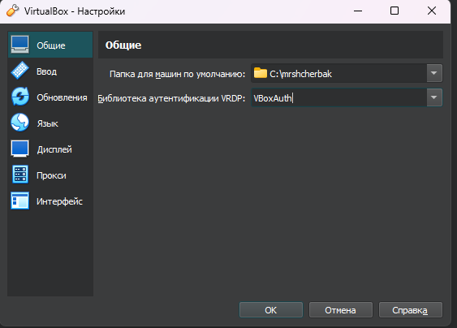
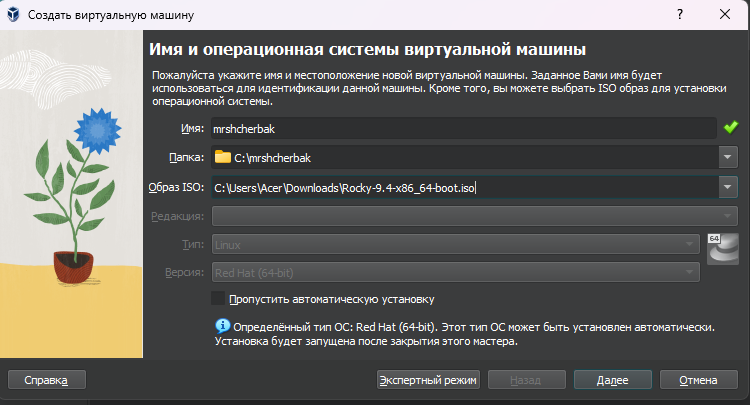
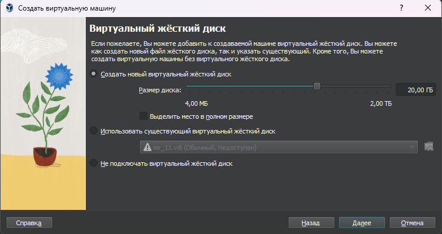
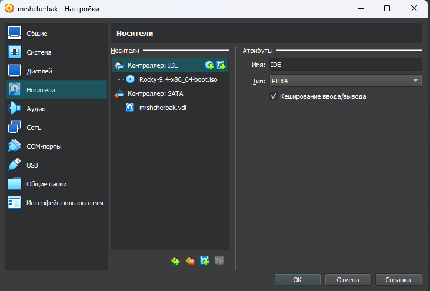
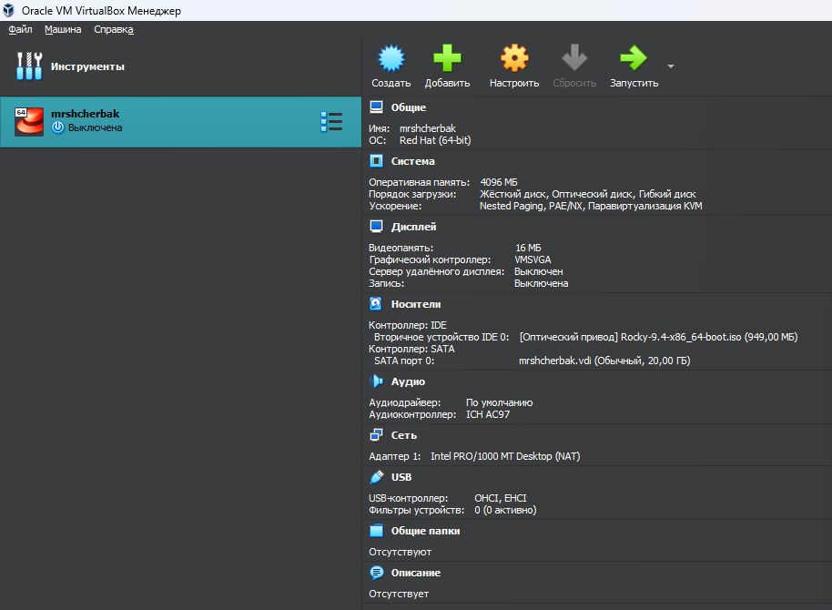
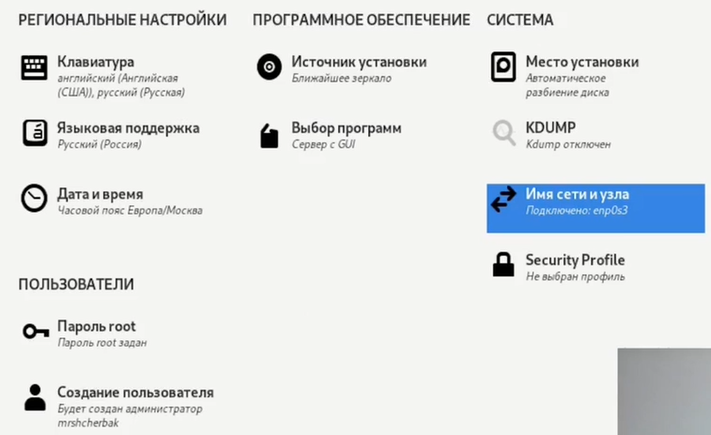
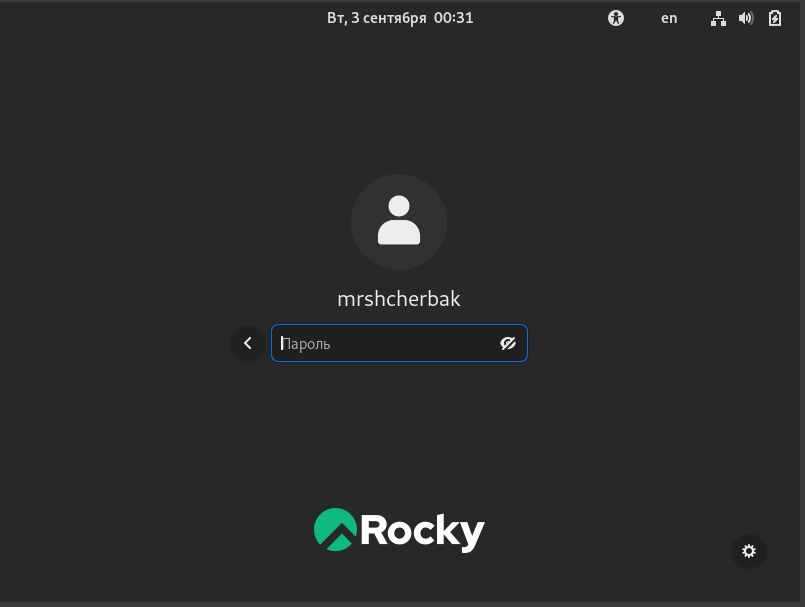
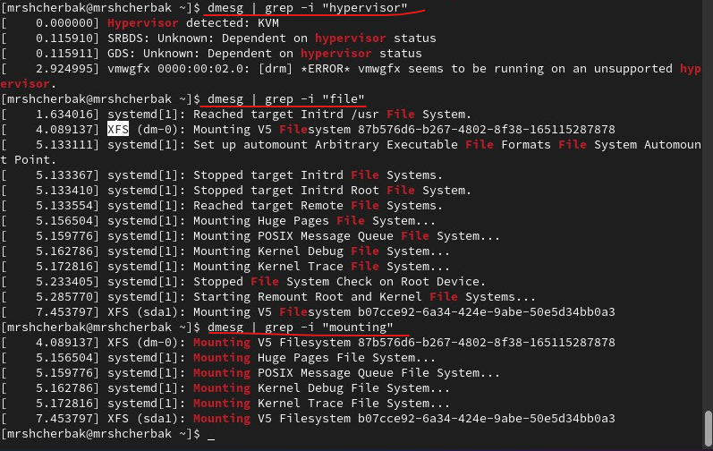
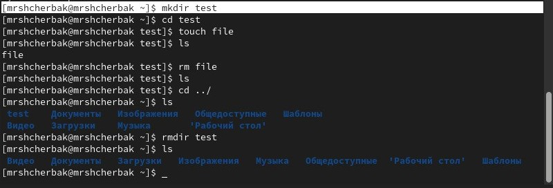

---
## Front matter

title: "Лабораторная работа №1"
subtitle: "Установка и конфигурация операционной системы на виртуальную машину"
author: "Щербак Маргарита Романовна, НПИбд-02-21"
date: "2024"
## Generic otions
lang: ru-RU
toc-title: "Содержание"

## Bibliography
bibliography: bib/cite.bib
csl: pandoc/csl/gost-r-7-0-5-2008-numeric.csl

## Pdf output format
toc: true # Table of contents
toc-depth: 2
lof: true # List of figures
fontsize: 12pt
linestretch: 1.5
papersize: a4
documentclass: scrreprt
## I18n polyglossia
polyglossia-lang:
  name: russian
  options:
	- spelling=modern
	- babelshorthands=true
polyglossia-otherlangs:
  name: english
## I18n babel
babel-lang: russian
babel-otherlangs: english
## Fonts
mainfont: PT Serif
romanfont: PT Serif
sansfont: PT Sans
monofont: PT Mono
mainfontoptions: Ligatures=TeX
romanfontoptions: Ligatures=TeX
sansfontoptions: Ligatures=TeX,Scale=MatchLowercase
monofontoptions: Scale=MatchLowercase,Scale=0.9
## Biblatex
biblatex: true
biblio-style: "gost-numeric"
biblatexoptions:
  - parentracker=true
  - backend=biber
  - hyperref=auto
  - language=auto
  - autolang=other*
  - citestyle=gost-numeric

## Pandoc-crossref LaTeX customization
figureTitle: "Скриншот"
tableTitle: "Таблица"
listingTitle: "Листинг"
lofTitle: "Список иллюстраций"
lotTitle: "Список таблиц"
lolTitle: "Листинги"
## Misc options
indent: true
header-includes:
  - \usepackage{indentfirst}
  - \usepackage{float} # keep figures where there are in the text
  - \floatplacement{figure}{H} # keep figures where there are in the text
---

# Цель работы

Приобрести практические навыки установки операционной системы на виртуальную машину и настройки минимально необходимых для дальнейшей работы сервисов.

# Теоретическое введение 

Информационная безопасность представляет собой защиту данных и поддерживающей инфраструктуры от случайных или преднамеренных воздействий природного или искусственного характера, которые могут нанести ущерб владельцам или пользователям этой информации и инфраструктуры [1].

Rocky Linux — это дистрибутив Linux, созданный Rocky Enterprise Software Foundation. Он задуман как полностью двоично-совместимый релиз, основанный на исходном коде операционной системы Red Hat Enterprise Linux (RHEL). Цель проекта — обеспечить сообщество корпоративной операционной системой производственного уровня, поддерживаемой сообществом. Rocky Linux наряду с Red Hat Enterprise Linux и SUSE Linux Enterprise стал популярен среди корпоративных пользователей [2].

# Выполнение лабораторной работы

1. Запустим VirtualBox, укажем расположение каталога виртуальных машин (рис.1), создадим новую виртуальную машину. Укажем имя виртуальной машины (mrshcherbak), тип операционной системы — Linux, RedHat (рис.2), размер основной памяти виртуальной машины − 4096 Мб. Зададим конфигурацию жёсткого диска — загрузочный, VDI (BirtualBox Disk Image), динамический виртуальный диск. Зададим размер диска — 20 ГБ (рис.3). Добавим новый привод оптических дисков и выберем образ операционной системы (рис.4).

{#fig:001 width=100%} 

{#fig:002 width=100%}

{#fig:003 width=100%}

{#fig:004 width=100%}

{#fig:005 width=100%}

2. Запустим виртуальную машину, выберем русский язык в качестве языка интерфейса и перейдём к настройкам установки операционной системы. В разделе выбора программ укажем в качестве базового окружения Server with GUI, а в качестве дополнения — Development Tools. Отключим KDUMP. Место установки ОС оставим без изменения. Включим сетевое соединение. Установим пароль для root. Зададим пользователя с правами администратора. Итог настроек показан на рис.6

{#fig:006 width=100%}

3. После завершения установки операционной системы корректно перезапустим виртуальную машину. Зайдем под своим пользователем с паролем (рис.7) и откроем терминал.

{#fig:007 width=100%}

4. Подключим образ диска дополнений гостевой ОС (рис.8). После загрузки дополнений нажмём Enter и корректно перезагрузим виртуальную машину.

{#fig:008 width=90%}

# Домашнее задание

1. Выполнила команду dmesg, dmesg | less. Команда dmesg выводит системные сообщения ядра Linux, связанные с загрузкой, оборудованием и ошибками. dmesg | less делает то же самое, но позволяет прокручивать вывод постранично для удобного чтения (рис.1 - рис.2).

{#fig:009 width=95%}

{#fig:0010 width=95%}

2. Путём ввода команды "dmesg | grep -i <то, что ищем>" получим следующую информацию:  
Версия ядра Linux (Linux version), частота процессора (Detected Mhz processor) и модель процессора (CPU0) (рис. 3). Версия Linux 5.14.0-427.33.1.el9_4.x86_64, частота 2208.000 MHz. 

{#fig:0011 width=95%}

3. Объем доступной оперативной памяти (Memory available) (рис.4).

{ #fig:012 width=95%}

4. Тип обнаруженного гипервизора (Hypervisor detected) (KVM), файловой системы корневого раздела (XFS) и последовательность монтирования файловых систем (рис.5).

{ #fig:013 width=95%}

# Вывод
Таким образом, в ходе ЛР№1 я приобрела практические навыки установки операционной системы на виртуальную машину и настройки минимально необходимых для дальнейшей работы сервисов.

# Контрольные вопросы

1. Какую информацию содержит учётная запись пользователя?  
Учётная запись хранит информацию о пользователе, которая нужна для регистрации и работы в системе: это системное имя, пользовательский идентификатор, идентификатор группы, полное имя, домашний каталог, оболочка и пароль.  
2. Укажите команды терминала и приведите примеры:
- для получения справки по команде;  
Команда man (man ls) и (man cat) (рис.1 - рис.2).

{#fig:0014 width=65%}

{#fig:0015 width=70%}

- для перемещения по файловой системе;
- для просмотра содержимого каталога;  
Команда cd и ls (рис.3).

{ #fig:0016 width=90% }

- для определения объёма каталога;  
sudo du -sh "путь к каталогу" (рис.4).

{#fig:0017 width=70%}

- для создания / удаления каталогов / файлов;  
touch "Имя_файла" / mkdir "Имя_каталога" / rmdir "Имя_каталога" / rm "Имя_файла" (рис.5).

{#fig:0018 width=90%}

- для задания определённых прав на файл / каталог;  
Команда chmod (chmod 777 test) (рис.6).

{ #fig:0019 width=90% }

- для просмотра истории команд.  
Команда history (рис.7).

{#fig:0020 width=90%}

3. Что такое файловая система? Приведите примеры с краткой характеристикой.  
Файловая система — это структура, которая определяет, как данные организуются, хранятся и именуются на устройствах хранения в компьютерах и других электронных устройствах. Она устанавливает правила для хранения информации в виде файлов и каталогов, определяет допустимую длину имен файлов, максимальный размер файлов и разделов, а также может предоставлять функции, такие как контроль доступа или шифрование данных [3].  
Примеры файловых систем:
- NTFS (New Technology File System): стандартная файловая система для Windows, которая поддерживает большие файлы, контроль доступа и шифрование.
- FAT32 (File Allocation Table 32): упрощённая файловая система от Microsoft, используемая на сменных носителях и поддерживающая кроссплатформенную совместимость, но с ограничением на размер файлов до 4 ГБ.
- XFS: журналируемая файловая система, разработанная для высокопроизводительных задач, широко используется в Linux и поддерживает работу с большими файлами и томами.
- ext4 (Fourth Extended File System): основная файловая система в Linux, улучшенная версия ext3, которая предлагает улучшенную производительность, большую надёжность и поддержку файлов большого размера.

4. Как посмотреть, какие файловые системы подмонтированы в ОС?  
С помощью команды mount (рис.8).

{ #fig:0021 width=83% }

5. Как удалить зависший процесс?  
Найти PID процесса с помощью команды pidof "Имя процесса", а затем для его удаления прописать команду kill "PID".

# Библиография

- Методические материалы курса.
- Rocky Linux Documentation. [Электронный ресурс]. М. URL: [Rocky Linux Documentation](https://docs.rockylinux.org) (Дата обращения: 03.09.2024).
- Файловая система. [Электронный ресурс]. М. URL: [Файловая система](https://ru.wikipedia.org/wiki/Файловая_система) (Дата обращения: 03.09.2024).