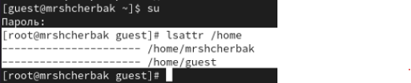

---
## Front matter
lang: ru-RU
title: Лабораторная работа №2
subtitle: Дискреционное разграничение прав в Linux. Основные атрибуты
author: |
        Щербак Маргарита Романовна
        \        
        НПИбд-02-21
        \
        Студ. билет: 1032216537
institute: |
           RUDN
date: |
      2024

babel-lang: russian
babel-otherlangs: english
mainfont: Arial
monofont: Courier New
fontsize: 10pt

## Formatting
toc: false
slide_level: 2
theme: metropolis
header-includes: 
 - \metroset{progressbar=frametitle,sectionpage=progressbar,numbering=fraction}
 - '\makeatletter'
 - '\beamer@ignorenonframefalse'
 - '\makeatother'
aspectratio: 43
section-titles: true
---

## Цель работы

Получение практических навыков работы в консоли с атрибутами файлов, закрепление теоретических основ дискреционного разграничения доступа в современных системах с открытым кодом на базе ОС Linux.

## Теоретическая справка

В операционной системе Linux управление правами доступа к файлам осуществляется с помощью атрибутов файлов, которые включают права на чтение, запись и выполнение для трёх категорий пользователей: владельца файла, группы и остальных пользователей. Эти атрибуты могут быть изменены и настроены с помощью команд консоли, что делает консоль важным инструментом для администрирования систем Linux.

## Выполнение лабораторной работы 

Создала учётную запись пользователя guest и задала пароль для пользователя guest (используя учётную запись администратора).

{ #fig:001 width=70% }

## Выполнение лабораторной работы

Вывод команды id совпадает с выводом команды groups (guest).

{ #fig:002 width=90% }

## Выполнение лабораторной работы

gid и uid совпадают со значениями из прошлых пунктов.

{ #fig:003 width=70% }

## Выполнение лабораторной работы

На директориях установлены права на чтение, запись и выполнение для владельца. Поддиректории /home - /guest и /mrshcherbak. Удалось увидеть расширенные атрибуты только директории того пользователя, от имени которого я нахожусь в системе. 

{ #fig:004 width=80% }

## Выполнение лабораторной работы

Расширенные атрибуты директиорий других пользователей удалось увидеть только от root.

{ #fig:005 width=80% }

## Выполнение лабораторной работы

{ #fig:006 width=80% }

## Выполнение лабораторной работы 

Попытаемся создать в директории dir1 файл file1 командой echo "test" > /home/guest/dir1/file1. Создать файл не получилось, т.к. у папки /dir нет права на запись в неё. Файл file1 в папке /dir не создался.

{ #fig:007 width=80% }

## Выполнение лабораторной работы 

Заполним таблицу «Установленные права и разрешённые действия», выполняя действия от имени владельца директории (файлов).

{ #fig:008 width=20% }

## Выполнение лабораторной работы

{ #fig:009 width=30% }

## Выполнение лабораторной работы

На основании заполненной таблицы определим те или иные минимально необходимые права для выполнения операций внутри директории dir1 

{ #fig:0010 width=80% }

## Вывод

В ходе ЛР№2 я приобрела практические навыки работы в консоли с атрибутами файлов, закрепила теоретические основы дискреционного разграничения доступа в современных системах с открытым кодом на базе ОС Linux.

## Библиография

1. Методические материалы курса.
2. Chmod. [Электронный ресурс]. М. URL: [Файловая система](https://ru.wikipedia.org/wiki/Chmod) (Дата обращения: 09.09.2024).

