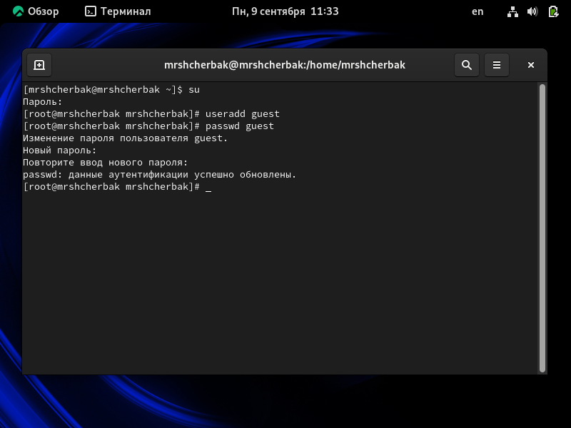
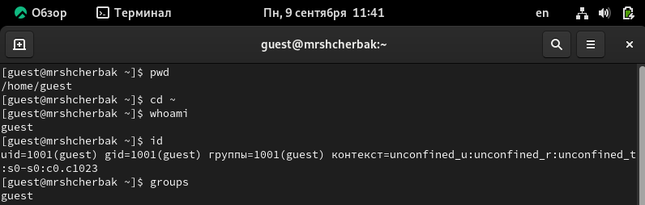
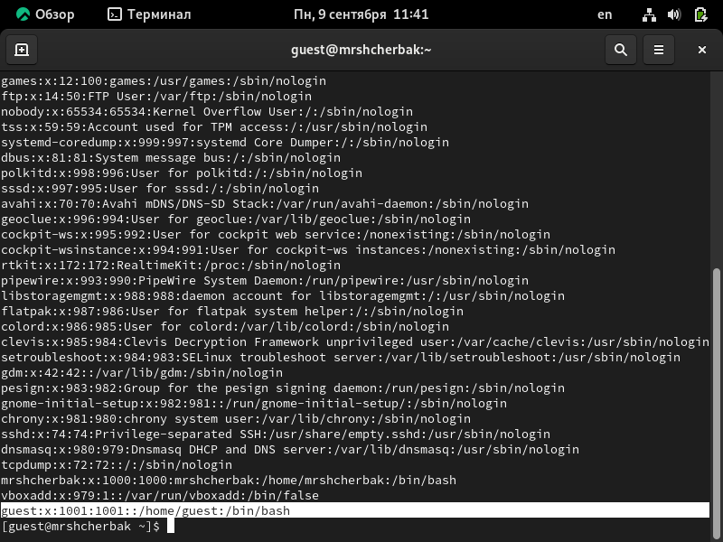
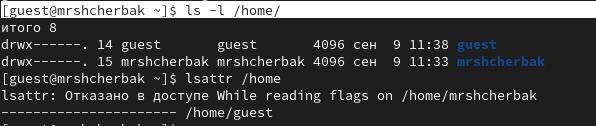
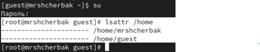
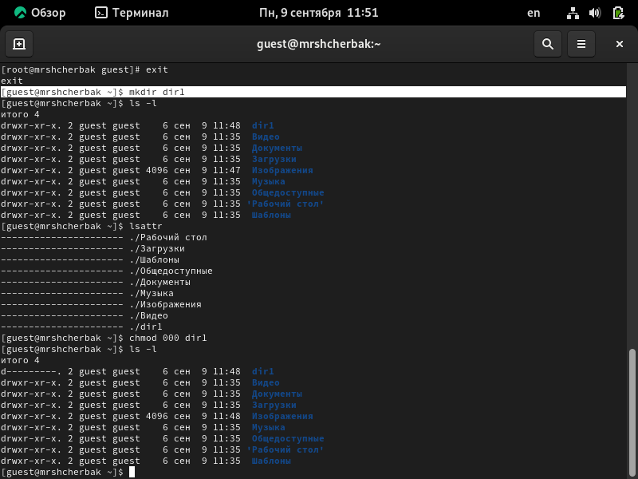
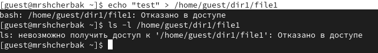
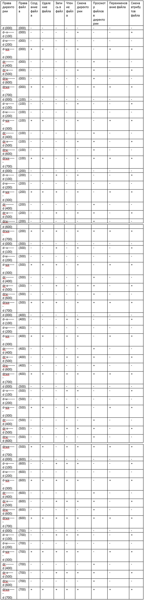
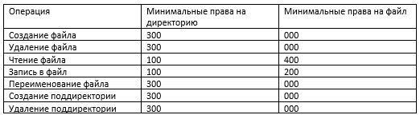

---
## Front matter

title: "Лабораторная работа №2"
subtitle: "Дискреционное разграничение прав в Linux. Основные атрибуты"
author: "Щербак Маргарита Романовна, НПИбд-02-21"
date: "2024"
## Generic otions
lang: ru-RU
toc-title: "Содержание"

## Bibliography
bibliography: bib/cite.bib
csl: pandoc/csl/gost-r-7-0-5-2008-numeric.csl

## Pdf output format
toc: true # Table of contents
toc-depth: 2
lof: true # List of figures
fontsize: 12pt
linestretch: 1.5
papersize: a4
documentclass: scrreprt
## I18n polyglossia
polyglossia-lang:
  name: russian
  options:
	- spelling=modern
	- babelshorthands=true
polyglossia-otherlangs:
  name: english
## I18n babel
babel-lang: russian
babel-otherlangs: english
## Fonts
mainfont: PT Serif
romanfont: PT Serif
sansfont: PT Sans
monofont: PT Mono
mainfontoptions: Ligatures=TeX
romanfontoptions: Ligatures=TeX
sansfontoptions: Ligatures=TeX,Scale=MatchLowercase
monofontoptions: Scale=MatchLowercase,Scale=0.9
## Biblatex
biblatex: true
biblio-style: "gost-numeric"
biblatexoptions:
  - parentracker=true
  - backend=biber
  - hyperref=auto
  - language=auto
  - autolang=other*
  - citestyle=gost-numeric

## Pandoc-crossref LaTeX customization
figureTitle: "Скриншот"
tableTitle: "Таблица"
listingTitle: "Листинг"
lofTitle: "Список иллюстраций"
lotTitle: "Список таблиц"
lolTitle: "Листинги"
## Misc options
indent: true
header-includes:
  - \usepackage{indentfirst}
  - \usepackage{float} # keep figures where there are in the text
  - \floatplacement{figure}{H} # keep figures where there are in the text
---

# Цель работы

Получение практических навыков работы в консоли с атрибутами файлов, закрепление теоретических основ дискреционного разграничения доступа в современных системах с открытым кодом на базе ОС Linux.

# Теоретическое введение 

В современных операционных системах безопасность и управление доступом к ресурсам имеют ключевое значение. Одним из базовых механизмов управления доступом является дискреционная модель разграничения доступа (DAC, Discretionary Access Control), которая позволяет владельцу ресурса (например, файла) определять, кто и каким образом может взаимодействовать с этим ресурсом. Этот метод широко используется в ОС с открытым исходным кодом, таких как Linux.

В операционной системе Linux управление правами доступа к файлам осуществляется с помощью атрибутов файлов, которые включают права на чтение, запись и выполнение для трёх категорий пользователей: владельца файла, группы и остальных пользователей. Эти атрибуты могут быть изменены и настроены с помощью команд консоли, что делает консоль важным инструментом для администрирования систем Linux [1].

# Выполнение лабораторной работы

1. В установленной при выполнении предыдущей лабораторной работы ОС создадим учётную запись пользователя guest (используя учётную запись администратора). Зададим пароль для пользователя guest (используя учётную запись администратора) (рис.1)

{ #fig:001 width=80% }

2. Войдём в систему от имени пользователя guest и определим директорию, в которой находимся, командой pwd.  Уточним имя пользователя командой whoami. Уточним имя пользователя, его группу, а также группы, куда входит пользователь, командой id. Выведенные значения uid, gid и др. запомним. Сравним вывод id с выводом команды groups (рис.2). Вывод команды id совпадает с выводом команды groups (guest).

{ #fig:002 width=90% }

3. Сравним полученную информацию об имени пользователя с данными, выводимыми в приглашении командной строки. Данные совпадают Просмотрим файл /etc/passwd командой cat /etc/passwd. Найдём в нём свою учётную запись. Определим uid пользователя. Определим gid пользователя (рис.3). gid и uid совпадают со значениями из прошлых пунктов.

{ #fig:003 width=90% }

4. Определим существующие в системе директории командой ls -l /home/ (рис.4). На директориях установлены права на чтение, запись и выполнение для владельца. Поддиректории /home - /guest и /mrshcherbak. Проверим, какие расширенные атрибуты установлены на поддиректориях, находящихся в директории /home, командой lsattr /home. Удалось увидеть расширенные атрибуты только директории того пользователя, от имени которого я нахожусь в системе. Расширенные атрибуты директиорий других пользователей удалось увидеть только от root.

{ #fig:004 width=90% }

{ #fig:005 width=90% }

5. Создадим в домашней директории поддиректорию dir1 командой mkdir dir1. Посмотрим командами ls -l и lsattr, какие права доступа и расширенные атрибуты были выставлены на директорию dir1. Снимием с директории dir1 все атрибуты командой chmod 000 dir1 (рис.6) [2].

{ #fig:006 width=90% }

6. Попытаемся создать в директории dir1 файл file1 командой echo "test" > /home/guest/dir1/file1 (рис.7). Создать файл не получилось, т.к. у папки /dir нет права на запись в неё. Файл file1 в папке /dir не создался.

{ #fig:007 width=90% }

7. Заполним таблицу «Установленные права и разрешённые действия», выполняя действия от имени владельца директории (файлов), определив опытным путём, какие операции разрешены, а какие нет. Если операция разрешена, занесём в таблицу знак «+», если не разрешена, знак «-». (рис.8).

{ #fig:008 width=90% }

8. На основании заполненной таблицы определим те или иные минимально необходимые права для выполнения операций внутри директории dir1 (рис.9).

{ #fig:009 width=90% }

# Вывод
В ходе ЛР№2 я приобрела практические навыки работы в консоли с атрибутами файлов, закрепила теоретические основы дискреционного разграничения доступа в современных системах с открытым кодом на базе ОС Linux.

# Библиография

1. Методические материалы курса.
2. Chmod. [Электронный ресурс]. М. URL: [Файловая система](https://ru.wikipedia.org/wiki/Chmod) (Дата обращения: 09.09.2024).
