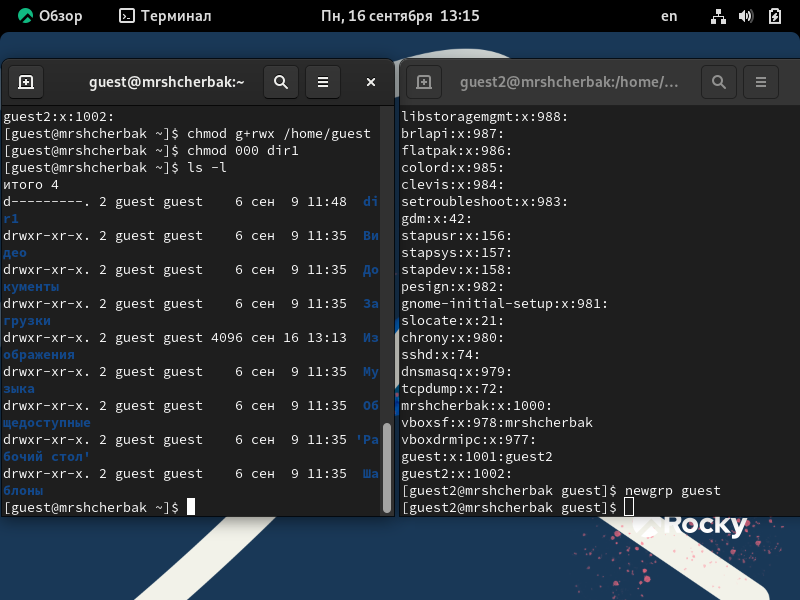
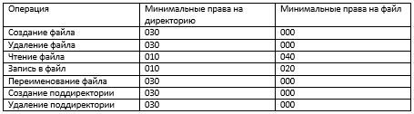

---
## Front matter

title: "Лабораторная работа №3"
subtitle: "Дискреционное разграничение прав в Linux. Два пользователя"
author: "Щербак Маргарита Романовна, НПИбд-02-21"
date: "2024"
## Generic otions
lang: ru-RU
toc-title: "Содержание"

## Bibliography
bibliography: bib/cite.bib
csl: pandoc/csl/gost-r-7-0-5-2008-numeric.csl

## Pdf output format
toc: true # Table of contents
toc-depth: 2
lof: true # List of figures
fontsize: 12pt
linestretch: 1.5
papersize: a4
documentclass: scrreprt
## I18n polyglossia
polyglossia-lang:
  name: russian
  options:
	- spelling=modern
	- babelshorthands=true
polyglossia-otherlangs:
  name: english
## I18n babel
babel-lang: russian
babel-otherlangs: english
## Fonts
mainfont: PT Serif
romanfont: PT Serif
sansfont: PT Sans
monofont: PT Mono
mainfontoptions: Ligatures=TeX
romanfontoptions: Ligatures=TeX
sansfontoptions: Ligatures=TeX,Scale=MatchLowercase
monofontoptions: Scale=MatchLowercase,Scale=0.9
## Biblatex
biblatex: true
biblio-style: "gost-numeric"
biblatexoptions:
  - parentracker=true
  - backend=biber
  - hyperref=auto
  - language=auto
  - autolang=other*
  - citestyle=gost-numeric

## Pandoc-crossref LaTeX customization
figureTitle: "Скриншот"
tableTitle: "Таблица"
listingTitle: "Листинг"
lofTitle: "Список иллюстраций"
lotTitle: "Список таблиц"
lolTitle: "Листинги"
## Misc options
indent: true
header-includes:
  - \usepackage{indentfirst}
  - \usepackage{float} # keep figures where there are in the text
  - \floatplacement{figure}{H} # keep figures where there are in the text
---

# Цель работы

Получение практических навыков работы в консоли с атрибутами файлов для групп пользователей [1].

# Теоретическое введение 

Информационная безопасность – это защищенность информации и поддерживающей инфраструктуры от случайных или преднамеренных воздействий естественного или искусственного характера, чреватых нанесением ущерба владельцам или пользователям информации и поддерживающей инфраструктуры.

Права доступа в системах управляют тем, какие операции может выполнять пользователь с определенными файлами и папками. Правильная настройка прав доступа помогает создать безопасную среду, где никто не сможет изменять ваши данные или нарушать работу важных системных файлов. Помимо групп root и users, в системе существует множество других, которые созданы для управления доступом программ к общим ресурсам. Участники каждой группы получают права на чтение или изменение конкретных файлов и каталогов, что регулирует их доступ и действия. Эти же права передаются процессам, которые запускает пользователь [2].

# Выполнение лабораторной работы

1. В установленной операционной системе создадим учётную запись пользователя guest2. Зададим пароль для пользователя guest2 (используя учётную запись администратора). Добавим пользователя guest2 в группу guest (рис.1).

{ #fig:001 width=90% }

2. Осуществим вход в систему от двух пользователей на двух разных консолях: guest на первой консоли и guest2 на второй консоли. Для обоих пользователей командой pwd определим директорию, в которой находимся. Сравним её с приглашениями командной строки (рис.2)

{ #fig:002 width=90% }

Для guest приглашение совпадает, для guest2 - приглашение guest

3. Уточним имя пользователя, его группу, кто входит в неё и к каким группам принадлежит он сам. Определим командами groups guest и groups guest2, в какие группы входят пользователи guest и guest2. Сравним вывод команды groups с выводом команд id -Gn и id -G (рис.3).

{ #fig:003 width=90% }

guest входит в группу guest, guest2 входит в группу guest и guest2. Вывод команды groups совпадает с выводами команд id -Gn и id -G.

4. Сравним полученную информацию с содержимым файла /etc/group (рис.4).

{ #fig:004 width=90% }

Информация совпадает.

5. От имени пользователя guest2 выполним регистрацию пользователя guest2 в группе guest командой newgrp guest. От имени пользователя guest изменим права директории /home/guest, разрешив все действия для пользователей группы. Далее от имени пользователя guest снимем с директории /home/guest/dir1 все атрибуты командой chmod 000 dirl. Проверим правильность снятия атрибутов. Выполненные действия показаны на рис.5.

{ #fig:005 width=90% }

6. Меняя атрибуты у директории dir1 и файла file1 от имени пользователя guest и делая проверку от пользователя guest2, заполним таблицу, определив опытным путём, какие операции разрешены, а какие нет. Если операция разрешена, занесём в таблицу знак «+», если не разрешена, знак «-» (рис.6).

{ #fig:006 width=90% }

7. На основании заполненной таблицы определим те или иные минимально необходимые права для выполнения операций внутри директории dir1 (рис.7).

{ #fig:007 width=90% }

# Вывод
Таким образом, в ходе ЛР№3 я получила практические навыки работы в консоли с атрибутами файлов для групп пользователей

# Библиография

1. Методические материалы курса.
2. Chmod. [Электронный ресурс]. М. URL: [Файловая система](https://ru.wikipedia.org/wiki/Chmod) (Дата обращения: 16.09.2022).

