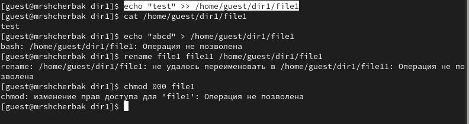

---
## Front matter
lang: ru-RU
title: Лабораторная работа №4
subtitle: Дискреционное разграничение прав в Linux. Расширенные атрибуты
author: |
        Щербак Маргарита Романовна
        \        
        НПИбд-02-21
        \
        Студ. билет: 1032216537
institute: |
           RUDN
date: |
      2024

babel-lang: russian
babel-otherlangs: english
mainfont: Arial
monofont: Courier New
fontsize: 10pt

## Formatting
toc: false
slide_level: 2
theme: metropolis
header-includes: 
 - \metroset{progressbar=frametitle,sectionpage=progressbar,numbering=fraction}
 - '\makeatletter'
 - '\beamer@ignorenonframefalse'
 - '\makeatother'
aspectratio: 43
section-titles: true
---

## **Цель работы**
Получение практических навыков работы в консоли с расширенными атрибутами файлов.

## **Теоретическая справка**
Информационная безопасность представляет собой защиту данных и поддерживающей инфраструктуры от случайных или преднамеренных воздействий природного или искусственного характера, которые могут нанести ущерб владельцам или пользователям этой информации и инфраструктуры.

## **Выполнение лабораторной работы** 

{ #fig:001 width=90% }

## **Выполнение лабораторной работы** 

{ #fig:002 width=90% }

## **Выполнение лабораторной работы** 

{ #fig:003 width=90% }

## **Выполнение лабораторной работы** 
Снимем расширенный атрибут a с файла /home/guest/dirl/file1 от имени суперпользователя командой chattr -a /home/guest/dir1/file1 Повторим операции, которые ранее не удавалось выполнить (рис.4).

{ #fig:004 width=80% }

## **Выполнение лабораторной работы** 

При применении расширенного атрибута "i" ни одного из действий, представленных в лабораторной работе, совершить не удалось.

{ #fig:005 width=80% }

## Вывод
Таким образом, в ходе ЛР№4 я получила практические навыки работы в консоли с расширенными атрибутами файлов.

## Библиография

1. Методические материалы курса.
2. Chmod. [Электронный ресурс]. М. URL: [Файловая система](https://ru.wikipedia.org/wiki/Chmod) (Дата обращения: 16.09.2024).

