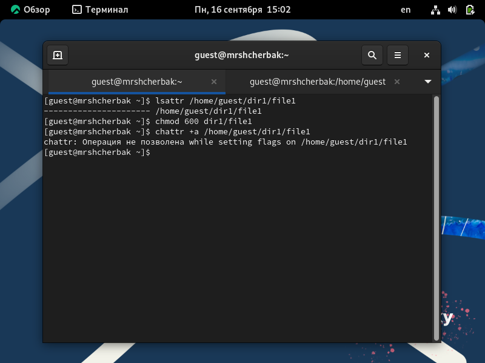

---
## Front matter
lang: ru-RU
title: Лабораторная работа №1
subtitle: Установка и конфигурация операционной системы на виртуальную машину
author: |
        Щербак Маргарита Романовна
        \        
        НПИбд-02-21
        \
        Студ. билет: 1032216537
institute: |
           RUDN
date: |
      2024

babel-lang: russian
babel-otherlangs: english
mainfont: Arial
monofont: Courier New
fontsize: 10pt

## Formatting
toc: false
slide_level: 2
theme: metropolis
header-includes: 
 - \metroset{progressbar=frametitle,sectionpage=progressbar,numbering=fraction}
 - '\makeatletter'
 - '\beamer@ignorenonframefalse'
 - '\makeatother'
aspectratio: 43
section-titles: true
---

## **Цель работы**
Приобрести практические навыки установки операционной системы на виртуальную машину и настройки минимально необходимых для дальнейшей работы сервисов.

## **Теоретическая справка**
Информационная безопасность представляет собой защиту данных и поддерживающей инфраструктуры от случайных или преднамеренных воздействий природного или искусственного характера, которые могут нанести ущерб владельцам или пользователям этой информации и инфраструктуры.

## **Выполнение лабораторной работы** 
Выбрала каталог для виртуальных машин и создала новую VB. Установила параметры: имя, тип ОС, объем памяти, динамический диск на 20 ГБ. Добавила оптический привод и указала образ ОС.

{#fig:001 width=65%} 

## Настройка виртуальной машины

{#fig:002 width=80%}

## Настройка виртуальной машины

{#fig:004 width=80%}

## Созданная виртуальная машина

{#fig:005 width=90%}

## Процесс настройки виртуальной машины

{#fig:006 width=85%}

## Перезапуск и вход 

{#fig:007 width=80%}

## Установка образа дополнений для гостевой ОС

{#fig:008 width=80%}

## Домашнее задание
Команда dmesg выводит системные сообщения ядра Linux, связанные с загрузкой, оборудованием и ошибками.

{#fig:009 width=65%}

## Версия ядра Linux, частота процессора и модель процессора

{#fig:0011 width=75%}

## Объем доступной оперативной памяти

{ #fig:012 width=75%}

## Домашнее задание

{ #fig:013 width=75%}

## Вывод
Таким образом, в ходе ЛР№1 я приобрела практические навыки установки операционной системы на виртуальную машину и настройки минимально необходимых для дальнейшей работы сервисов.

## Библиография

- Методические материалы курса.
- Rocky Linux Documentation. [Электронный ресурс]. М. URL: [Rocky Linux Documentation](https://docs.rockylinux.org) (Дата обращения: 03.09.2024).
- Файловая система. [Электронный ресурс]. М. URL: [Файловая система](https://ru.wikipedia.org/wiki/Файловая_система) (Дата обращения: 03.09.2024).

