---
## Front matter
lang: ru-RU
title: Лабораторная работа №5
subtitle: Дискреционное разграничение прав в Linux. Исследование влияния дополнительных атрибутов
author: |
        Щербак Маргарита Романовна
        \        
        НПИбд-02-21
        \
        Студ. билет: 1032216537
institute: |
           RUDN
date: |
      2024

babel-lang: russian
babel-otherlangs: english
mainfont: Arial
monofont: Courier New
fontsize: 10pt

## Formatting
toc: false
slide_level: 2
theme: metropolis
header-includes: 
 - \metroset{progressbar=frametitle,sectionpage=progressbar,numbering=fraction}
 - '\makeatletter'
 - '\beamer@ignorenonframefalse'
 - '\makeatother'
aspectratio: 43
section-titles: true
---

## **Цель работы**
Изучение механизмов изменения идентификаторов, применения SetUID- и Sticky-битов. Получение практических навыков работы в консоли с дополнительными атрибутами. Рассмотрение работы механизма смены идентификатора процессов пользователей, а также влияние бита Sticky на запись и удаление файлов.

## **Теоретическая справка**
Информационная безопасность представляет собой защиту данных и поддерживающей инфраструктуры от случайных или преднамеренных воздействий природного или искусственного характера, которые могут нанести ущерб владельцам или пользователям этой информации и инфраструктуры.

## Выполнение лабораторной работы. Создание программы
Я подготовила лабораторный стенд. У меня был установлен gcc. Я вошла в систему от имени пользователя guest. Создала программу simpleid.c.

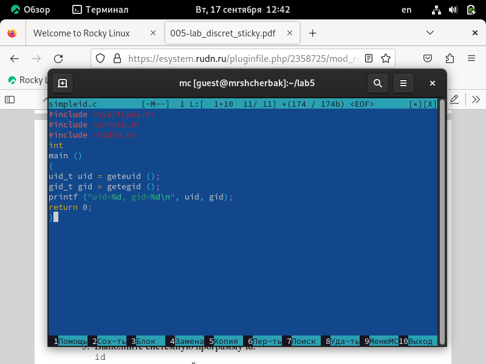{ #fig:001 width=65% }

## Выполнение лабораторной работы

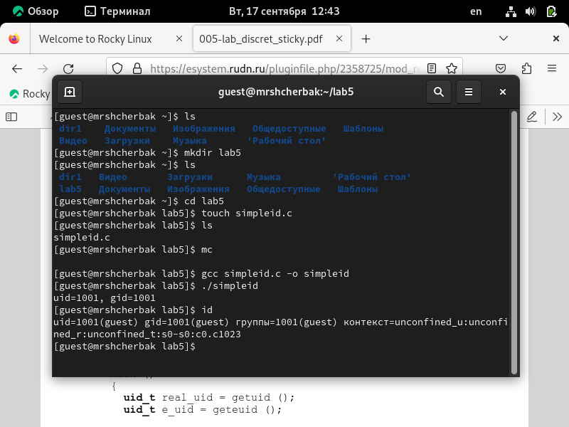{ #fig:002 width=80% }

## Выполнение лабораторной работы
Усложнила программу, добавив вывод действительных идентификаторов. Получившуюся программу назвала simpleid2.c.

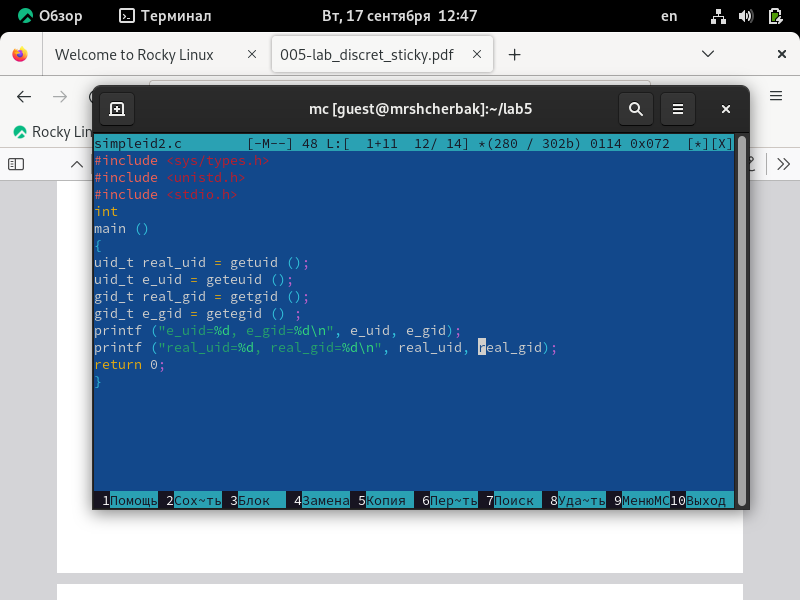{ #fig:003 width=70% }

## Выполнение лабораторной работы

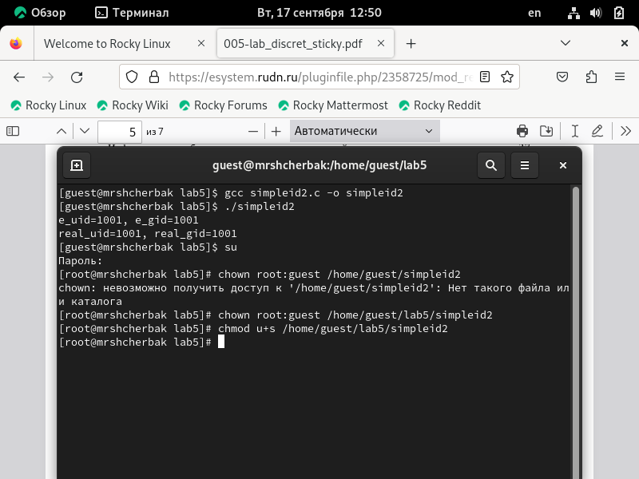{ #fig:004 width=86% }

## Выполнение лабораторной работы
Выполнила проверку правильности установки новых атрибутов и смены
владельца файла simpleid2. Запустила simpleid2 и id. Результаты совпадают.

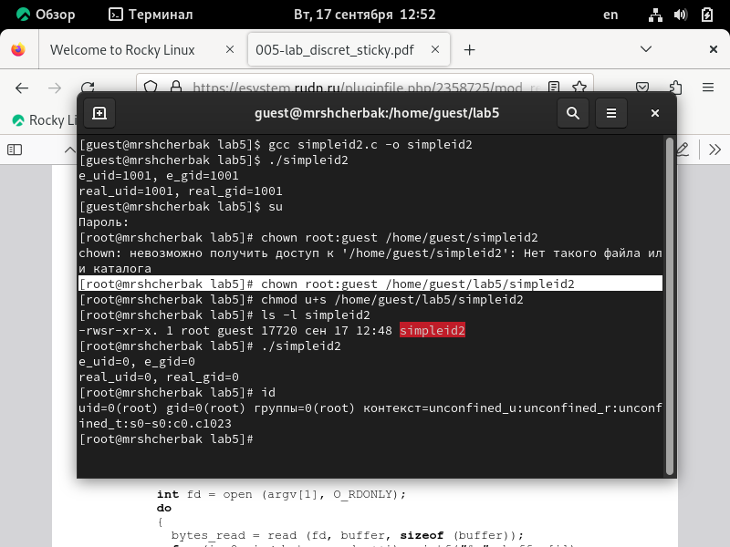{ #fig:005 width=65% }

## Выполнение лабораторной работы
Проделала то же самое относительно SetGID-бита. Создала программу readfile.c.

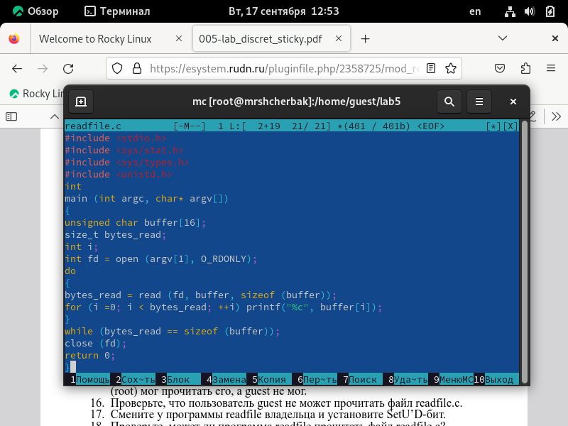{ #fig:006 width=67% }

## Выполнение лабораторной работы

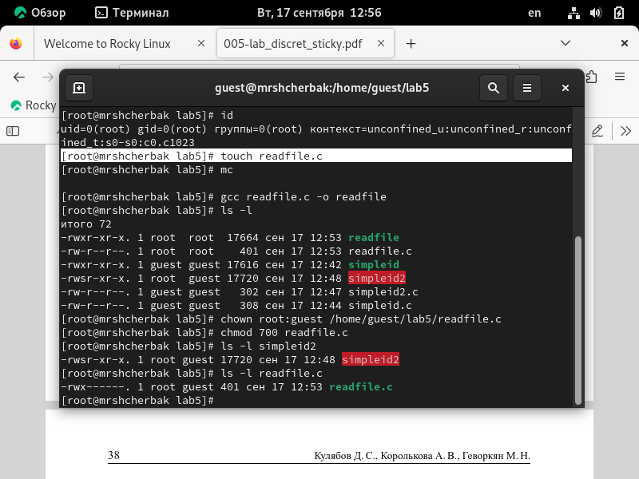{ #fig:007 width=85% }

## Выполнение лабораторной работы
Проверила, что пользователь guest не может прочитать файл readfile.c.

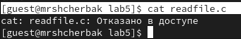{ #fig:008 width=90% }

## Выполнение лабораторной работы

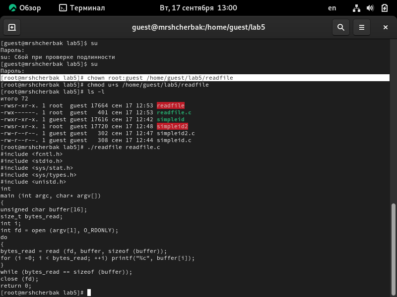{ #fig:009 width=85% }

## Выполнение лабораторной работы

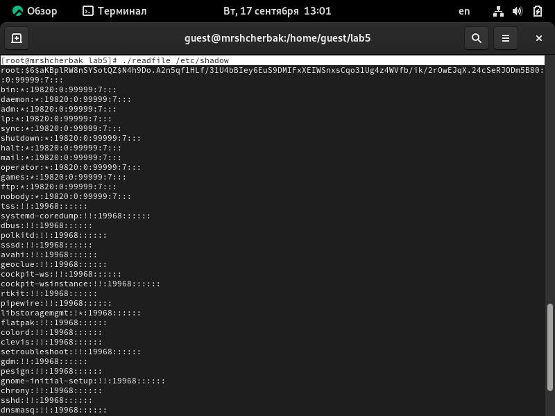{ #fig:0010 width=85% }

## Выполнение лабораторной работы. Исследование Sticky-бита

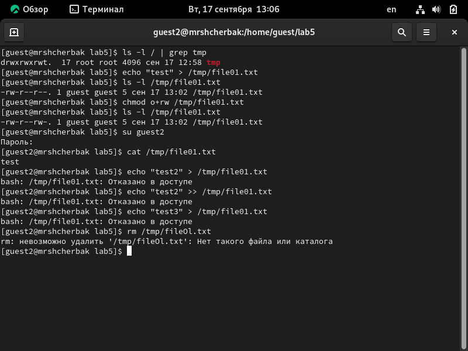{ #fig:0011 width=80% }

## Выполнение лабораторной работы

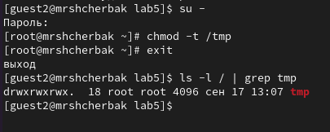{ #fig:0012 width=90% }

## Выполнение лабораторной работы
Повторила предыдущие шаги. Повысила свои права до суперпользователя и вернула атрибут t на директорию /tmp.

{ #fig:0013 width=80% }

## Вывод

Таким образом, в ходе ЛР№5 я изучила механизмы изменения идентификаторов, применения SetUID- и Sticky-битов. Получил практические навыки работы в консоли с дополнительными атрибутами. Рассмотрел работы механизма смены идентификатора процессов пользователей, а также влияние бита Sticky на запись и удаление файлов.

## Библиография

1. Методические материалы курса.
2. Chmod. [Электронный ресурс]. М. URL: [Файловая система](https://ru.wikipedia.org/wiki/Chmod) (Дата обращения: 17.09.2024).
