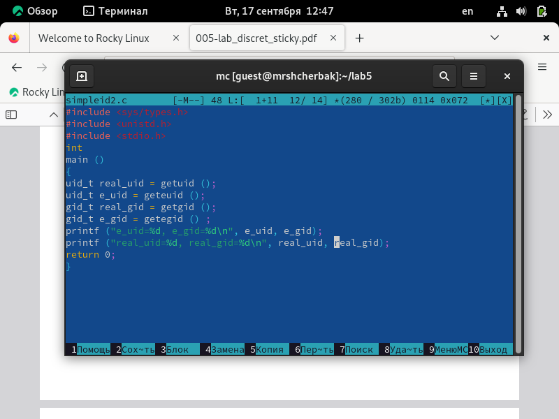

---
## Front matter

title: "Лабораторная работа №5"
subtitle: "Дискреционное разграничение прав в Linux. Исследование влияния дополнительных атрибутов"
author: "Щербак Маргарита Романовна, НПИбд-02-21"
date: "2024"
## Generic otions
lang: ru-RU
toc-title: "Содержание"

## Bibliography
bibliography: bib/cite.bib
csl: pandoc/csl/gost-r-7-0-5-2008-numeric.csl

## Pdf output format
toc: true # Table of contents
toc-depth: 2
lof: true # List of figures
fontsize: 12pt
linestretch: 1.5
papersize: a4
documentclass: scrreprt
## I18n polyglossia
polyglossia-lang:
  name: russian
  options:
	- spelling=modern
	- babelshorthands=true
polyglossia-otherlangs:
  name: english
## I18n babel
babel-lang: russian
babel-otherlangs: english
## Fonts
mainfont: PT Serif
romanfont: PT Serif
sansfont: PT Sans
monofont: PT Mono
mainfontoptions: Ligatures=TeX
romanfontoptions: Ligatures=TeX
sansfontoptions: Ligatures=TeX,Scale=MatchLowercase
monofontoptions: Scale=MatchLowercase,Scale=0.9
## Biblatex
biblatex: true
biblio-style: "gost-numeric"
biblatexoptions:
  - parentracker=true
  - backend=biber
  - hyperref=auto
  - language=auto
  - autolang=other*
  - citestyle=gost-numeric

## Pandoc-crossref LaTeX customization
figureTitle: "Скриншот"
tableTitle: "Таблица"
listingTitle: "Листинг"
lofTitle: "Список иллюстраций"
lotTitle: "Список таблиц"
lolTitle: "Листинги"
## Misc options
indent: true
header-includes:
  - \usepackage{indentfirst}
  - \usepackage{float} # keep figures where there are in the text
  - \floatplacement{figure}{H} # keep figures where there are in the text
---

# Цель работы

Изучение механизмов изменения идентификаторов, применения SetUID- и Sticky-битов. Получение практических навыков работы в консоли с дополнительными атрибутами. Рассмотрение работы механизма смены идентификатора процессов пользователей, а также влияние бита Sticky на запись и удаление файлов [1].

# Теоретическое введение 

Информационная безопасность – это защищенность информации и поддерживающей инфраструктуры от случайных или преднамеренных воздействий естественного или искусственного характера, чреватых нанесением ущерба владельцам или пользователям информации и поддерживающей инфраструктуры.

Права доступа в системах управляют тем, какие операции может выполнять пользователь с определенными файлами и папками. Правильная настройка прав доступа помогает создать безопасную среду, где никто не сможет изменять ваши данные или нарушать работу важных системных файлов. Помимо групп root и users, в системе существует множество других, которые созданы для управления доступом программ к общим ресурсам. Участники каждой группы получают права на чтение или изменение конкретных файлов и каталогов, что регулирует их доступ и действия. Эти же права передаются процессам, которые запускает пользователь [2].

# Выполнение лабораторной работы

## Создание программы

1. Я подготовила лабораторный стенд. У меня был установлен gcc. Я вошла в систему от имени пользователя guest. Создала программу simpleid.c (рис.1).

{ #fig:001 width=90% }

2. Скомплилировала программу и убедилась, что файл программы создан. Выполнила программу simpleid. Выполнила системную программу id и сравнила полученный результат с данными предыдущего пункта задания. Результаты совпадают (рис.2).

{ #fig:002 width=90% }

3. Усложнила программу, добавив вывод действительных идентификаторов. Получившуюся программу назвала simpleid2.c (рис.3).

{ #fig:003 width=90% }

4. Скомпилировала и запустила simpleid2.c. От имени суперпользователя выполнила команды: chown root:guest /home/guest/simpleid2 и chmod u+s /home/guest/simpleid2 (рис.4).

{ #fig:004 width=90% }

- sudo: выполняет одну команду с правами суперпользователя (root) без полного переключения на него. Требует пароль.
- su: полностью переключает на другого пользователя (обычно root) с его окружением, требуя пароль этого пользователя.

5. Выполнила проверку правильности установки новых атрибутов и смены
владельца файла simpleid2. Запустила simpleid2 и id. Результаты совпадают (рис.5).

{ #fig:005 width=90% }

6. Проделала то же самое относительно SetGID-бита. Создала программу readfile.c (рис.6).

{ #fig:006 width=90% }

7. Откомпилировала её. Сменила владельца у файла readfile.c и изменила права так, чтобы только суперпользователь (root) мог прочитать его, a guest не мог (рис.7).

{ #fig:007 width=90% }

8. Проверила, что пользователь guest не может прочитать файл readfile.c (рис.8).

{ #fig:008 width=90% }

9. Сменила у программы readfile владельца и установила SetU’D-бит Проверила, может ли программа readfile прочитать файл readfile.c (рис.9).

{ #fig:009 width=90% }

10. Проверила, может ли программа readfile прочитать файл /etc/shadow (рис.10).

{ #fig:0010 width=90% }

Программа может прочитать оба файла.

## Исследование Sticky-бита

1. Выяснила, установлен ли атрибут Sticky на директории /tmp, для чего выполните команду ls -l / | grep tmp. Атрибут "t" установлен. От имени пользователя guest создала файл file01.txt в директории /tmp
со словом test. Просмотрела атрибуты у только что созданного файла и разрешила чтение и запись для категории пользователей «все остальные». От пользователя guest2 (не являющегося владельцем) попробовала прочитать файл /tmp/file01.txt. От пользователя guest2 попробовала дозаписать в файл /tmp/file01.txt слово test2. От пользователя guest2 попробовала удалить файл /tmp/file01.txt командой
rm /tmp/fileOl.txt (рис.11). Операции выполнить не удалось.

{ #fig:0011 width=90% }

2. Повысила свои права до суперпользователя следующей командой su - и выполнила после этого команду, снимающую атрибут t (Sticky-бит) с директории /tmp. Покинула режим суперпользователя командой
exit. От пользователя guest2 проверила, что атрибута t у директории /tmp нет (рис.12).

{ #fig:0012 width=90% }

3. Повторила предыдущие шаги. Повысила свои права до суперпользователя и вернула атрибут t на директорию /tmp (рис.13).

{ #fig:0013 width=90% }

# Вывод
Таким образом, в ходе ЛР№5 я изучила механизмы изменения идентификаторов, применения SetUID- и Sticky-битов. Получил практические навыки работы в консоли с дополнительными атрибутами. Рассмотрел работы механизма смены идентификатора процессов пользователей, а также влияние бита Sticky на запись и удаление файлов.

# Библиография

1. Методические материалы курса.
2. Chmod. [Электронный ресурс]. М. URL: [Файловая система](https://ru.wikipedia.org/wiki/Chmod) (Дата обращения: 17.09.2024).

