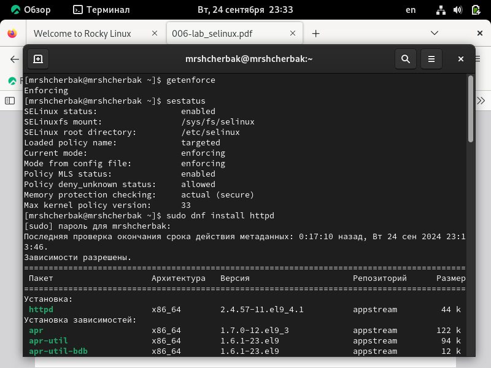
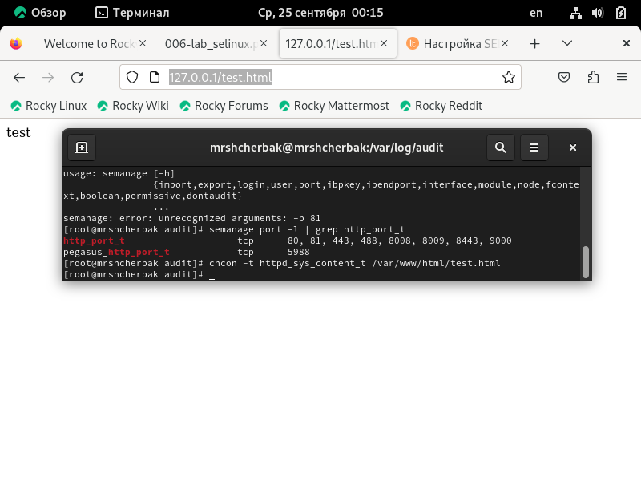

---
## Front matter
lang: ru-RU
title: Лабораторная работа №6
subtitle: Мандатное разграничение прав в Linux
author: |
        Щербак Маргарита Романовна
        \        
        НПИбд-02-21
        \
        Студ. билет: 1032216537
institute: |
           RUDN
date: |
      2024

babel-lang: russian
babel-otherlangs: english
mainfont: Arial
monofont: Courier New
fontsize: 10pt

## Formatting
toc: false
slide_level: 2
theme: metropolis
header-includes: 
 - \metroset{progressbar=frametitle,sectionpage=progressbar,numbering=fraction}
 - '\makeatletter'
 - '\beamer@ignorenonframefalse'
 - '\makeatother'
aspectratio: 43
section-titles: true
---

## **Цель работы**
Развить навыки администрирования ОС Linux. Получить первое практическое знакомство с технологией SELinux. Проверить работу SELinux на практике совместно с веб-сервером Apache.

## **Теоретическая справка**
Информационная безопасность представляет собой защиту данных и поддерживающей инфраструктуры от случайных или преднамеренных воздействий природного или искусственного характера, которые могут нанести ущерб владельцам или пользователям этой информации и инфраструктуры.

## **Выполнение лабораторной работы** 

{ #fig:001 width=80% }

## **Выполнение лабораторной работы** 
Обратитилась с помощью браузера к веб-серверу, запущенному на компьютере, и убедилась, что последний работает.

{ #fig:002 width=70% }

## **Выполнение лабораторной работы** 
Нашла веб-сервер Apache в списке процессов. 

{ #fig:003 width=80% }

## **Выполнение лабораторной работы** 
Посмотрела текущее состояние переключателей SELinux для Apache.

{ #fig:004 width=70% }

## **Выполнение лабораторной работы** 
Посмотрела статистику по политике с помощью команды seinfo.

{ #fig:005 width=80% }

## **Выполнение лабораторной работы**

{ #fig:006 width=90% }

## **Выполнение лабораторной работы**
Создала от имени суперпользователя html-файл /var/www/html/test.html следующего содержания. А также проверила контекст созданного файла - httpd_sys_cоntent_t.

{ #fig:007 width=80% }

## **Выполнение лабораторной работы**
Проверила контекст созданного файла. Обратилась к файлу через веб-сервер.

{ #fig:008 width=70% }

## **Выполнение лабораторной работы**
Проверила контекст файла командой ls -Z. Изменила контекст файла с httpd_sys_content_t на samba_share_t.

{ #fig:009 width=70% }

## **Выполнение лабораторной работы**
Попробовала ещё раз получить доступ к файлу через веб-сервер. Получила сообщение об ошибке.

{ #fig:010 width=70% }

## **Выполнение лабораторной работы**
Просмотрела log-файлы веб-сервера Apache. Также просмотрела системный лог-файл: tail /var/log/messages.

{ #fig:011 width=70% }

## **Выполнение лабораторной работы**

{ #fig:012 width=80% }

## **Выполнение лабораторной работы**
Попробовала запустить веб-сервер Apache на прослушивание ТСР-порта 81. 

{ #fig:013 width=65% }

## **Выполнение лабораторной работы**
Выполните перезапуск веб-сервера Apache. 

{ #fig:014 width=65% }

## **Выполнение лабораторной работы**

{ #fig:015 width=90% }

## **Выполнение лабораторной работы**

{ #fig:016 width=90% }

## **Выполнение лабораторной работы**

{ #fig:017 width=90% }

## **Выполнение лабораторной работы**
Исправила обратно конфигурационный файл apache, вернув Listen 80.Удалила привязку http_port_t к 81 порту: semanage port -d -t http_port_t -p tcp 81. Удалила файл /var/www/html/test.html (рис.18).

{ #fig:018 width=70% }

## Вывод
Таким образом, в ходе ЛР№6 я развила навыки администрирования ОС Linux. Получила первое практическое знакомство с технологией SELinux.
Проверила работу SELinux на практике совместно с веб-сервером Apache.

## Библиография

1. Методические материалы курса.
2. Linux Kernel Security [Электронный ресурс]: URL: http://www.cyberciti.biz/tips/selinux-vs-apparmor-vs-grsecurity.html (дата обращения 24.09.2024)
3. Security-Enhanced Linux [Электронный ресурс]: Официальный сайт SELinux. URL: http://www.nsa.gov/research/selinux/index.shtml (дата обращения 24.09.2024)
