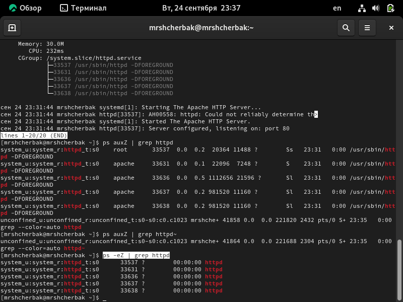

---
## Front matter

title: "Лабораторная работа №6"
subtitle: "Мандатное разграничение прав в Linux"
author: "Щербак Маргарита Романовна, НПИбд-02-21"
date: "2024"
## Generic otions
lang: ru-RU
toc-title: "Содержание"

## Bibliography
bibliography: bib/cite.bib
csl: pandoc/csl/gost-r-7-0-5-2008-numeric.csl

## Pdf output format
toc: true # Table of contents
toc-depth: 2
lof: true # List of figures
fontsize: 12pt
linestretch: 1.5
papersize: a4
documentclass: scrreprt
## I18n polyglossia
polyglossia-lang:
  name: russian
  options:
	- spelling=modern
	- babelshorthands=true
polyglossia-otherlangs:
  name: english
## I18n babel
babel-lang: russian
babel-otherlangs: english
## Fonts
mainfont: PT Serif
romanfont: PT Serif
sansfont: PT Sans
monofont: PT Mono
mainfontoptions: Ligatures=TeX
romanfontoptions: Ligatures=TeX
sansfontoptions: Ligatures=TeX,Scale=MatchLowercase
monofontoptions: Scale=MatchLowercase,Scale=0.9
## Biblatex
biblatex: true
biblio-style: "gost-numeric"
biblatexoptions:
  - parentracker=true
  - backend=biber
  - hyperref=auto
  - language=auto
  - autolang=other*
  - citestyle=gost-numeric

## Pandoc-crossref LaTeX customization
figureTitle: "Скриншот"
tableTitle: "Таблица"
listingTitle: "Листинг"
lofTitle: "Список иллюстраций"
lotTitle: "Список таблиц"
lolTitle: "Листинги"
## Misc options
indent: true
header-includes:
  - \usepackage{indentfirst}
  - \usepackage{float} # keep figures where there are in the text
  - \floatplacement{figure}{H} # keep figures where there are in the text
---

# Цель работы

Развить навыки администрирования ОС Linux. Получить первое практическое знакомство с технологией SELinux. Проверить работу SELinux на практике совместно с веб-сервером Apache [1].

# Теоретическое введение 

Информационная безопасность представляет собой защиту данных и поддерживающей инфраструктуры от случайных или преднамеренных воздействий природного или искусственного характера, которые могут нанести ущерб владельцам или пользователям этой информации и инфраструктуры [1].

Мандатное разграничение прав (Mandatory Access Control, MAC) — это метод управления доступом, где права пользователей и процессов определяются на системном уровне и не могут быть изменены без административного вмешательства. В отличие от дискреционного контроля доступа (DAC), где пользователи могут самостоятельно устанавливать права на свои файлы, MAC жестко контролирует доступ к ресурсам на основании политик безопасности [2].

SELinux (Security-Enhanced Linux) — это система MAC в Linux, которая реализует разграничение прав через политики безопасности [3].

# Выполнение лабораторной работы

1. Вошла в систему с полученными учётными данными и убедилась, что SELinux работает в режиме enforcing политики targeted с помощью команд getenforce и sestatus (рис.1).

{ #fig:001 width=90% }

2. Обратитилась с помощью браузера к веб-серверу, запущенному на компьютере, и убедилась, что последний работает (рис.2).

{ #fig:002 width=90% }

3. Нашла веб-сервер Apache в списке процессов. Его контекст безопасности httpd_sys_cоntent_t (рис.3).

{ #fig:003 width=90% }

4. Посмотрела текущее состояние переключателей SELinux для Apache (рис.4).

{ #fig:004 width=90% }

5. Посмотрела статистику по политике с помощью команды seinfo, также определила множество пользователей, ролей, типов (рис.5).

{ #fig:005 width=90% }

6. Определила тип файлов и поддиректорий, находящихся в директории 
/var/www. Определила тип файлов, находящихся в директории /var/www/html. Определила круг пользователей, которым разрешено создание файлов в директории /var/www/html - только владелец (рис.6).

{ #fig:006 width=90% }

7. Создала от имени суперпользователя html-файл /var/www/html/test.html следующего содержания. А также проверила контекст созданного файла - httpd_sys_cоntent_t (рис.7).

{ #fig:007 width=90% }

8. Проверила контекст созданного файла. Обратилась к файлу через веб-сервер, введя в браузере адрес http://127.0.0.1/test.html. Убедилась, что файл был успешно отображён (рис.8). Файл был успешно отображён.

{ #fig:008 width=90% }

9. Проверила контекст файла /var/www/html/test.html командой ls -Z. Изменила контекст файла /var/www/html/test.html с httpd_sys_content_t на samba_share_t (рис.9).

{ #fig:009 width=90% }

10. Попробовала ещё раз получить доступ к файлу через веб-сервер, введя в браузере адрес http://127.0.0.1/test.html. Получила сообщение об ошибке (рис.10).

{ #fig:010 width=90% }

11. Просмотрела log-файлы веб-сервера Apache. Также просмотрела системный лог-файл: tail /var/log/messages (рис.11 - рис.12).

{ #fig:011 width=90% }

{ #fig:012 width=90% }

12. Попробовала запустить веб-сервер Apache на прослушивание ТСР-порта 81. Для этого в файле /etc/httpd/httpd.conf нашла строчку Listen 80 и заменила её на Listen 81 (рис.13).

{ #fig:013 width=90% }

13. Выполните перезапуск веб-сервера Apache. Сбоя нет.Проанализировала лог-файлы: tail -nl /var/log/messages (рис.14). Просмотрела файлы /var/log/http/error_log,
/var/log/http/access_log и /var/log/audit/audit.log (рис.15 - рис.16).

{ #fig:014 width=90% }

{ #fig:015 width=90% }

{ #fig:016 width=90% }

14. Выполнила команду semanage port -a -t http_port_t -р tcp 81. После этого проверила список портов командой
semanage port -l | grep http_port_t. Убедилась, что порт 81 появился в списке. Попробовала запустить веб-сервер Apache ещё раз. Порт 81 был в списке до этого, поэтому сбоя не было. Вернула контекст httpd_sys_cоntent__t к файлу /var/www/html/ test.html: chcon -t httpd_sys_content_t /var/www/html/test.html.
После этого попробовала получить доступ к файлу через веб-сервер, введя в браузере адрес http://127.0.0.1:81/test.html. Увидела содержимое файла — слово «test» (рис.17).

{ #fig:017 width=90% }

15. Исправила обратно конфигурационный файл apache, вернув Listen 80.Удалила привязку http_port_t к 81 порту: semanage port -d -t http_port_t -p tcp 81. Удалила файл /var/www/html/test.html (рис.18).

{ #fig:018 width=90% }

# Вывод
Таким образом, в ходе ЛР№6 я развила навыки администрирования ОС Linux. Получила первое практическое знакомство с технологией SELinux.
Проверила работу SELinux на практике совместно с веб-сервером Apache.

# Библиография

1. Методические материалы курса.
2. Linux Kernel Security [Электронный ресурс]: URL: http://www.cyberciti.biz/tips/selinux-vs-apparmor-vs-grsecurity.html (дата обращения 24.09.2024)
3. Security-Enhanced Linux [Электронный ресурс]: Официальный сайт SELinux. URL: http://www.nsa.gov/research/selinux/index.shtml (дата обращения 24.09.2024)
