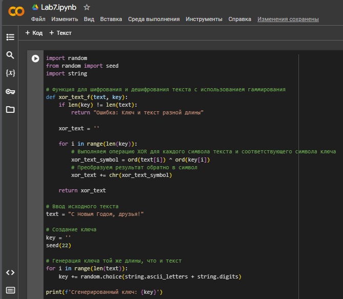

---
## Front matter
lang: ru-RU
title: Лабораторная работа №7
subtitle: "Элементы криптографии. Однократное гаммирование"
author: |
        Щербак Маргарита Романовна
        \        
        НПИбд-02-21
        \
        Студ. билет: 1032216537
institute: |
           RUDN
date: |
      2024

babel-lang: russian
babel-otherlangs: english
mainfont: Arial
monofont: Courier New
fontsize: 8pt

## Formatting
toc: false
slide_level: 2
theme: metropolis
header-includes: 
 - \metroset{progressbar=frametitle,sectionpage=progressbar,numbering=fraction}
 - '\makeatletter'
 - '\beamer@ignorenonframefalse'
 - '\makeatother'
aspectratio: 43
section-titles: true
---

## **Цель работы**
Освоить на практике применение режима однократного гаммирования.

## **Теоретическая справка**
**Гаммирование** представляет собой наложение (снятие) на открытые (зашифрованные) данные последовательности элементов 
других данных, полученной с помощью некоторого криптографического алгоритма, для получения зашифрованных (открытых) данных. 
Иными словами, наложение гаммы — это сложение её элементов с элементами открытого (закрытого) текста по некоторому 
фиксированному модулю, значение которого представляет собой известную часть алгоритма шифрования.

## Задание 

Нужно подобрать ключ, чтобы получить сообщение «С Новым Годом,
друзья!». Требуется разработать приложение, позволяющее шифровать и
дешифровать данные в режиме однократного гаммирования. Приложение
должно:  
1. Определить вид шифротекста при известном ключе и известном открытом тексте.  
2. Определить ключ, с помощью которого шифротекст может быть преобразован в некоторый фрагмент текста, представляющий собой один из возможных вариантов прочтения открытого текста.

## **Выполнение лабораторной работы** 

Ввела известный открытый текст: ```text = "С Новым Годом, друзья!"```, после чего создала ключ:  
```python
key = '' 
seed(22) 
for i in range(len(text)):
    key += random.choice(string.ascii_letters 
    + string.digits)
```
## **Выполнение лабораторной работы** 

Прописала получение шифротекста с использованием функции ```xor_text_f```: ```xor_text = xor_text_f(text, key)```. В этом моменте я пмередаю известный текст и сгенерированный ключ в функцию ```xor_text_f```, которая выполняет операцию XOR. Результат этой операции (шифротекст) сохраняется в переменной ```xor_text```. Вывод шифротекста: ```print(f'Шифротекст: {xor_text}')```. Так я создала шифротекст на основе известного открытого текста и ключа.

## **Выполнение лабораторной работы** 

Далее перешла к определению ключа. Дешифрование шифротекста (здесь я беру шифротекст и применяю к нему ту же функцию ```xor_text_f```, используя тот же ключ. Это позволяет получить обратно оригинальный открытый текст): 
```python
decrypted_text = xor_text_f(xor_text, key)
print(f'Расшифрованный текст: {decrypted_text}')
```
## **Выполнение лабораторной работы** 
Получение ключа (В этом моменте я выполняю XOR между открытым текстом и шифротекстом, что в результате даст ключ): 
```python
recovered_key = xor_text_f(text, xor_text)
print(f'Восстановленный ключ: {recovered_key}')
```
## **Выполнение лабораторной работы** 

Код целиком показан на рис.1:

{ #fig:001 width=70% }

## **Выполнение лабораторной работы** 
Результат кода (рис.2):

{ #fig:002 width=60% }

## Вывод
Таким образом, в ходе ЛР№7 я освоила на практике применение режима однократного гаммирования.

## Библиография

- Методические материалы курса.

