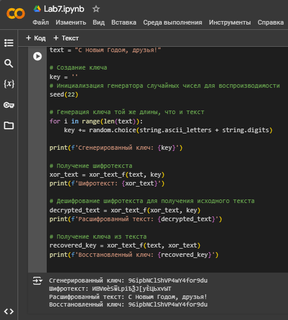

---
## Front matter

title: "Лабораторная работа №7"
subtitle: "Элементы криптографии. Однократное гаммирование"
author: "Щербак Маргарита Романовна, НПИбд-02-21"
date: "2024"
## Generic otions
lang: ru-RU
toc-title: "Содержание"

## Bibliography
bibliography: bib/cite.bib
csl: pandoc/csl/gost-r-7-0-5-2008-numeric.csl

## Pdf output format
toc: true # Table of contents
toc-depth: 2
lof: true # List of figures
fontsize: 12pt
linestretch: 1.5
papersize: a4
documentclass: scrreprt
## I18n polyglossia
polyglossia-lang:
  name: russian
  options:
	- spelling=modern
	- babelshorthands=true
polyglossia-otherlangs:
  name: english
## I18n babel
babel-lang: russian
babel-otherlangs: english
## Fonts
mainfont: PT Serif
romanfont: PT Serif
sansfont: PT Sans
monofont: PT Mono
mainfontoptions: Ligatures=TeX
romanfontoptions: Ligatures=TeX
sansfontoptions: Ligatures=TeX,Scale=MatchLowercase
monofontoptions: Scale=MatchLowercase,Scale=0.9
## Biblatex
biblatex: true
biblio-style: "gost-numeric"
biblatexoptions:
  - parentracker=true
  - backend=biber
  - hyperref=auto
  - language=auto
  - autolang=other*
  - citestyle=gost-numeric

## Pandoc-crossref LaTeX customization
figureTitle: "Скриншот"
tableTitle: "Таблица"
listingTitle: "Листинг"
lofTitle: "Список иллюстраций"
lotTitle: "Список таблиц"
lolTitle: "Листинги"
## Misc options
indent: true
header-includes:
  - \usepackage{indentfirst}
  - \usepackage{float} # keep figures where there are in the text
  - \floatplacement{figure}{H} # keep figures where there are in the text
---

# Цель работы

Освоить на практике применение режима однократного гаммирования.

# Теоретическое введение 

Предложенная Г. С. Вернамом так называемая «схема однократного использования (гаммирования)» является простой, но 
надёжной схемой шифрования данных [1].

**Гаммирование** представляет собой наложение (снятие) на открытые (зашифрованные) данные последовательности элементов 
других данных, полученной с помощью некоторого криптографического алгоритма, для получения зашифрованных (открытых) данных. 
Иными словами, наложение гаммы — это сложение её элементов с элементами открытого (закрытого) текста по некоторому 
фиксированному модулю, значение которого представляет собой известную часть алгоритма шифрования.

В соответствии с теорией криптоанализа, если в методе шифрования используется однократная вероятностная гамма 
(однократное гаммирование) той же длины, что и подлежащий сокрытию текст, то текст нельзя раскрыть. Даже при раскрытии 
части последовательности гаммы нельзя получить информацию о всём скрываемом тексте.

Наложение гаммы по сути представляет собой выполнение операции сложения по модулю 2 (XOR) (обозначаемая знаком (+)) 
между элементами гаммы и элементами подлежащего сокрытию текста. Напомним, как работает операция XOR над битами: 
0 (+) 0 = 0, 0 (+) 1 = 1, 1 (+) 0 = 1, 1 (+) 1 = 0.

Такой метод шифрования является симметричным, так как двойное прибавление одной и той же величины по модулю 2 
восстанавливает исходное значение, а шифрование и расшифрование выполняется одной и той же программой.

# Задание 

Нужно подобрать ключ, чтобы получить сообщение «С Новым Годом,
друзья!». Требуется разработать приложение, позволяющее шифровать и
дешифровать данные в режиме однократного гаммирования. Приложение
должно:  
1. Определить вид шифротекста при известном ключе и известном открытом тексте.  
2. Определить ключ, с помощью которого шифротекст может быть преобразован в некоторый фрагмент текста, представляющий собой один из возможных вариантов прочтения открытого текста.

# Выполнение лабораторной работы

Ввела известный открытый текст: ```text = "С Новым Годом, друзья!"```, после чего создала ключ:  
```python
key = '' 
seed(22) 
for i in range(len(text)):
    key += random.choice(string.ascii_letters + string.digits)
```
Прописала получение шифротекста с использованием функции ```xor_text_f```: ```xor_text = xor_text_f(text, key)```. В этом моменте я пмередаю известный текст и сгенерированный ключ в функцию ```xor_text_f```, которая выполняет операцию XOR. Результат этой операции (шифротекст) сохраняется в переменной ```xor_text```. Вывод шифротекста: ```print(f'Шифротекст: {xor_text}')```. Так я создала шифротекст на основе известного открытого текста и ключа.

Далее перешла к определению ключа. Дешифрование шифротекста (здесь я беру шифротекст и применяю к нему ту же функцию ```xor_text_f```, используя тот же ключ. Это позволяет получить обратно оригинальный открытый текст): 
```python
decrypted_text = xor_text_f(xor_text, key)
print(f'Расшифрованный текст: {decrypted_text}')
```
Получение ключа (В этом моменте я выполняю XOR между открытым текстом и шифротекстом, что в результате даст ключ): 
```python
recovered_key = xor_text_f(text, xor_text)
print(f'Восстановленный ключ: {recovered_key}')
```

Код целиком с функциями ниже:
```python
import random
from random import seed
import string

# Функция для шифрования и дешифрования текста с использованием гаммирования
def xor_text_f(text, key):
    if len(key) != len(text):
        return "Ошибка: Ключ и текст разной длины"

    xor_text = ''

    for i in range(len(key)):
        # XOR для каждого символа текста и соответств. символа ключа
        xor_text_symbol = ord(text[i]) ^ ord(key[i])
        # Преобразуем результат обратно в символ
        xor_text += chr(xor_text_symbol)

    return xor_text

# исходный текст
text = "С Новым Годом, друзья!"

key = ''
seed(22)
# Генерация ключа той же длины, что и текст
for i in range(len(text)):
    key += random.choice(string.ascii_letters + string.digits)

print(f'Сгенерированный ключ: {key}')

# Получение шифротекста 
xor_text = xor_text_f(text, key)
print(f'Шифротекст: {xor_text}')

# Дешифрование шифротекста для получения исходного текста
decrypted_text = xor_text_f(xor_text, key)
print(f'Расшифрованный текст: {decrypted_text}')

# Получение ключа из текста
recovered_key = xor_text_f(text, xor_text)
print(f'Восстановленный ключ: {recovered_key}')
```

Результат кода (рис.1):

{ #fig:001 width=90% }

[ССЫЛКА НА COLAB с кодом и результатами](https://colab.research.google.com/drive/1XoFxB9B2r2zRVSfJ0OuCMbbwGiSq-PA4?usp=sharing)

# Вывод

Таким образом, в ходе ЛР№7 я освоила на практике применение режима однократного гаммирования.

# Контрольные вопросы

1. Поясните смысл однократного гаммирования.

Гаммирование - выполнение операции
сложения по модулю 2 (XOR) между элементами гаммы и элементами подлежащего сокрытию текста. Если в методе шифрования используется однократная вероятностная гамма (однократное гаммирование) той же длины, что и подлежащий сокрытию текст, то текст нельзя раскрыть. Даже при раскрытии части последовательности гаммы нельзя получить информацию о всём скрываемом тексте.

2. Перечислите недостатки однократного гаммирования.

Абсолютная стойкость шифра доказана только в случае, когда однократно используемый ключ длиной, равной длине исходного сообщения, является фрагментом истинно случайной двоичной последовательности с равномерным законом распределения.

3. Перечислите преимущества однократного гаммирования.

Такой метод шифрования является симметричным, так как двойное прибавление одной и той же величины по модулю 2 восстанавливает исходное значение, а шифрование и расшифрование выполняется одной и той же программой. Криптоалгоритм не даёт никакой информации об открытом тексте: при известном зашифрованном сообщении C все различные ключевые последовательности K возможны и равновероятны, а значит, возможны и любые сообщения P.


4. Почему длина открытого текста должна совпадать с длиной ключа?

Если ключ длиннее текста - появится неоднозначность декодирования, а если короче - операция XOR будет применена не ко всем элементам.

5. Какая операция используется в режиме однократного гаммирования, назовите её особенности?

Используется операция XOR, которая является симметричной.

6. Как по открытому тексту и ключу получить шифротекст?

Если известны ключ и открытый текст, то задача нахождения шифротекста заключается в применении к каждому символу открытого текста следующего правила:
Ci = Pi (+) Ki
где Ci — i-й символ получившегося зашифрованного послания, Pi — i-й символ открытого текста, Ki — i-й символ ключа, i = 1, m. 

7. Как по открытому тексту и шифротексту получить ключ?

Если известны шифротекст и открытый текст, то обе части равенства необходимо сложить по модулю 2 с Pi:
Ci (+) Pi = Pi (+) Ki (+) Pi = Ki,
Ki = Ci (+) Pi.

8. В чем заключаются необходимые и достаточные условия абсолютной стойкости шифра?

Необходимые и достаточные условия абсолютной стойкости шифра:
– полная случайность ключа;
– равенство длин ключа и открытого текста;
– однократное использование ключа.

# Библиография

1. Методические материалы курса.

