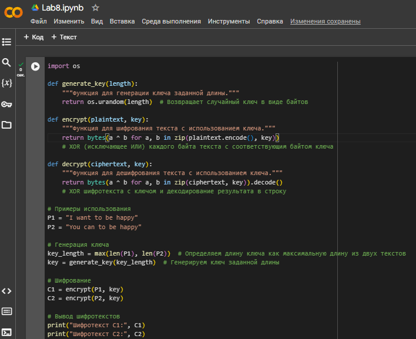

---
## Front matter
lang: ru-RU
title: Лабораторная работа №8
subtitle: "Элементы криптографии. Шифрование (кодирование) различных исходных текстов одним ключом"
author: |
        Щербак Маргарита Романовна
        \        
        НПИбд-02-21
        \
        Студ. билет: 1032216537
institute: |
           RUDN
date: |
      2024

babel-lang: russian
babel-otherlangs: english
mainfont: Arial
monofont: Courier New
fontsize: 8pt

## Formatting
toc: false
slide_level: 2
theme: metropolis
header-includes: 
 - \metroset{progressbar=frametitle,sectionpage=progressbar,numbering=fraction}
 - '\makeatletter'
 - '\beamer@ignorenonframefalse'
 - '\makeatother'
aspectratio: 43
section-titles: true
---

## **Цель работы**
Освоить на практике применение режима однократного гаммирования на примере кодирования различных исходных текстов одним ключом.

## **Теоретическая справка**
**Гаммирование** представляет собой наложение (снятие) на открытые (зашифрованные) данные последовательности элементов 
других данных, полученной с помощью некоторого криптографического алгоритма, для получения зашифрованных (открытых) данных. 
Иными словами, наложение гаммы — это сложение её элементов с элементами открытого (закрытого) текста по некоторому 
фиксированному модулю, значение которого представляет собой известную часть алгоритма шифрования.

## Задание 

Два текста кодируются одним ключом (однократное гаммирование).
Требуется не зная ключа и не стремясь его определить, прочитать оба текста. Необходимо разработать приложение, позволяющее шифровать и дешифровать тексты P1 и P2 в режиме однократного гаммирования. Приложение должно определить вид шифротекстов C1 и C2 обоих текстов P1 и
P2 при известном ключе ; необходимо определить и выразить аналитически способ, при котором злоумышленник может прочитать оба текста, не
зная ключа и не стремясь его определить.

## **Выполнение лабораторной работы** 

1. Генерация ключа: использовала функцию ```generate_key```, которая создает случайный ключ заданной длины (максимальной длины между двумя текстами P1 и P2).
2. Шифрование текстов: функция ```encrypt``` применяет операцию XOR между каждым байтом открытого текста и соответствующим байтом ключа.
Оба текста (P1 и P2) шифруются с использованием одного и того же ключа, и результаты сохраняются в переменных C1 и C2.
3. Дешифрование текстов: функция ```decrypt``` применяет ту же операцию XOR между шифротекстами и ключом, что позволяет восстановить оригинальные тексты P1 и P2.

## **Выполнение лабораторной работы** 
Чтобы злоумышленник мог прочитать оба текста, не зная ключа, можно использовать следующие методы:

- Анализ шифротекстов: Если злоумышленник имеет доступ к шифротекстам C1 и C2, он может заметить, что они были зашифрованы с помощью одного и того же ключа.
- Сравнительный анализ: При XOR-операции, если одно и то же значение (например, буква 'H') XOR'ится с одним и тем же байтом ключа, то это создает предсказуемый паттерн.
- Статистический анализ: Если злоумышленник знает, что тексты имеют характерный шаблон (например, фразы на английском языке), он может использовать статистические методы, чтобы проанализировать и, возможно, расшифровать тексты.

## **Выполнение лабораторной работы** 

Итак, код эффективно реализует шифрование и дешифрование текстов в режиме однократного гаммирования. Однако он также иллюстрирует потенциальные уязвимости, которые могут быть использованы злоумышленниками для расшифровки текстов без знания ключа.

## **Выполнение лабораторной работы** 

Код целиком показан на рис.1:

{ #fig:001 width=70% }

## **Выполнение лабораторной работы** 
Результат кода (рис.2):

{ #fig:002 width=70% }

## Вывод
Таким образом, в ходе ЛР№8 я освоила на практике применение режима однократного гаммирования на примере кодирования различных исходных текстов одним ключом.

## Библиография

- Методические материалы курса.

