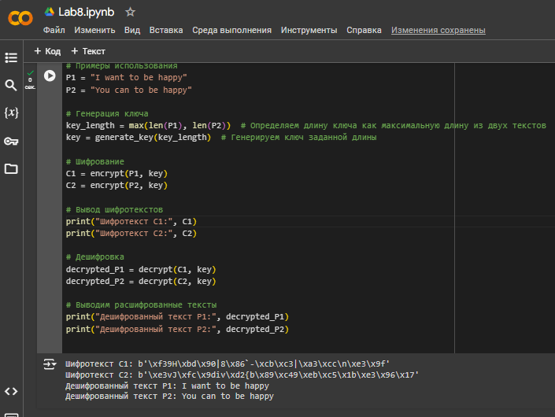

---
## Front matter

title: "Лабораторная работа №8"
subtitle: "Элементы криптографии. Шифрование (кодирование) различных исходных текстов одним ключом"
author: "Щербак Маргарита Романовна, НПИбд-02-21"
date: "2024"
## Generic otions
lang: ru-RU
toc-title: "Содержание"

## Bibliography
bibliography: bib/cite.bib
csl: pandoc/csl/gost-r-7-0-5-2008-numeric.csl

## Pdf output format
toc: true # Table of contents
toc-depth: 2
lof: true # List of figures
fontsize: 12pt
linestretch: 1.5
papersize: a4
documentclass: scrreprt
## I18n polyglossia
polyglossia-lang:
  name: russian
  options:
	- spelling=modern
	- babelshorthands=true
polyglossia-otherlangs:
  name: english
## I18n babel
babel-lang: russian
babel-otherlangs: english
## Fonts
mainfont: PT Serif
romanfont: PT Serif
sansfont: PT Sans
monofont: PT Mono
mainfontoptions: Ligatures=TeX
romanfontoptions: Ligatures=TeX
sansfontoptions: Ligatures=TeX,Scale=MatchLowercase
monofontoptions: Scale=MatchLowercase,Scale=0.9
## Biblatex
biblatex: true
biblio-style: "gost-numeric"
biblatexoptions:
  - parentracker=true
  - backend=biber
  - hyperref=auto
  - language=auto
  - autolang=other*
  - citestyle=gost-numeric

## Pandoc-crossref LaTeX customization
figureTitle: "Скриншот"
tableTitle: "Таблица"
listingTitle: "Листинг"
lofTitle: "Список иллюстраций"
lotTitle: "Список таблиц"
lolTitle: "Листинги"
## Misc options
indent: true
header-includes:
  - \usepackage{indentfirst}
  - \usepackage{float} # keep figures where there are in the text
  - \floatplacement{figure}{H} # keep figures where there are in the text
---

# Цель работы

Освоить на практике применение режима однократного гаммирования на примере кодирования различных исходных текстов одним ключом.

# Теоретическое введение 

Предложенная Г. С. Вернамом так называемая «схема однократного использования (гаммирования)» является простой, но 
надёжной схемой шифрования данных [1].

**Гаммирование** представляет собой наложение (снятие) на открытые (зашифрованные) данные последовательности элементов 
других данных, полученной с помощью некоторого криптографического алгоритма, для получения зашифрованных (открытых) данных. 
Иными словами, наложение гаммы — это сложение её элементов с элементами открытого (закрытого) текста по некоторому 
фиксированному модулю, значение которого представляет собой известную часть алгоритма шифрования.

В соответствии с теорией криптоанализа, если в методе шифрования используется однократная вероятностная гамма 
(однократное гаммирование) той же длины, что и подлежащий сокрытию текст, то текст нельзя раскрыть. Даже при раскрытии 
части последовательности гаммы нельзя получить информацию о всём скрываемом тексте.

Наложение гаммы по сути представляет собой выполнение операции сложения по модулю 2 (XOR) (обозначаемая знаком (+)) 
между элементами гаммы и элементами подлежащего сокрытию текста. Напомним, как работает операция XOR над битами: 
0 (+) 0 = 0, 0 (+) 1 = 1, 1 (+) 0 = 1, 1 (+) 1 = 0.

Такой метод шифрования является симметричным, так как двойное прибавление одной и той же величины по модулю 2 
восстанавливает исходное значение, а шифрование и расшифрование выполняется одной и той же программой.

# Задание 

Два текста кодируются одним ключом (однократное гаммирование).
Требуется не зная ключа и не стремясь его определить, прочитать оба текста. Необходимо разработать приложение, позволяющее шифровать и дешифровать тексты P1 и P2 в режиме однократного гаммирования. Приложение должно определить вид шифротекстов C1 и C2 обоих текстов P1 и
P2 при известном ключе ; необходимо определить и выразить аналитически способ, при котором злоумышленник может прочитать оба текста, не
зная ключа и не стремясь его определить.

# Выполнение лабораторной работы

1. Генерация ключа: использовала функцию ```generate_key```, которая создает случайный ключ заданной длины (максимальной длины между двумя текстами P1 и P2).
2. Шифрование текстов: функция ```encrypt``` применяет операцию XOR между каждым байтом открытого текста и соответствующим байтом ключа.
Оба текста (P1 и P2) шифруются с использованием одного и того же ключа, и результаты сохраняются в переменных C1 и C2.
3. Дешифрование текстов: функция ```decrypt``` применяет ту же операцию XOR между шифротекстами и ключом, что позволяет восстановить оригинальные тексты P1 и P2.

Чтобы злоумышленник мог прочитать оба текста, не зная ключа, можно использовать следующие методы:

- Анализ шифротекстов: Если злоумышленник имеет доступ к шифротекстам C1 и C2, он может заметить, что они были зашифрованы с помощью одного и того же ключа.
- Сравнительный анализ: При XOR-операции, если одно и то же значение (например, буква 'H') XOR'ится с одним и тем же байтом ключа, то это создает предсказуемый паттерн.
- Статистический анализ: Если злоумышленник знает, что тексты имеют характерный шаблон (например, фразы на английском языке), он может использовать статистические методы, чтобы проанализировать и, возможно, расшифровать тексты.

Итак, код эффективно реализует шифрование и дешифрование текстов в режиме однократного гаммирования. Однако он также иллюстрирует потенциальные уязвимости, которые могут быть использованы злоумышленниками для расшифровки текстов без знания ключа.

Код целиком с функциями ниже:
```python
import os 

def generate_key(length):
    """Функция для генерации ключа заданной длины."""
    return os.urandom(length)  # Возвращает случайный ключ в виде байтов

def encrypt(plaintext, key):
    """Функция для шифрования текста с использованием ключа."""
    return bytes(a ^ b for a, b in zip(plaintext.encode(), key))
    # XOR каждого байта текста с соответств. байтом ключа

def decrypt(ciphertext, key):
    """Функция для дешифрования текста с использованием ключа."""
    return bytes(a ^ b for a, b in zip(ciphertext, key)).decode()
    # XOR шифротекста с ключом и декодирование результата в строку

# Примеры использования
P1 = "I want to be happy"  
P2 = "You can to be happy" 

# Генерация ключа
# Определяем длину ключа как макс. длину из 2х текстов
key_length = max(len(P1), len(P2))  
key = generate_key(key_length)  # Генерируем ключ заданной длины

# Шифрование
C1 = encrypt(P1, key)  
C2 = encrypt(P2, key)  

# Вывод шифротекстов
print("Шифротекст C1:", C1)  
print("Шифротекст C2:", C2)  

# Дешифровка
decrypted_P1 = decrypt(C1, key)  
decrypted_P2 = decrypt(C2, key)  

# Выводим расшифрованные тексты
print("Дешифрованный текст P1:", decrypted_P1)  
print("Дешифрованный текст P2:", decrypted_P2)  

```

Результат кода (рис.1):

{ #fig:001 width=90% }

[ССЫЛКА НА COLAB с кодом и результатами](https://colab.research.google.com/drive/1135W72s2lXVqFZblT0Mol8sl75sT8pkX?usp=sharing)

# Вывод

Таким образом, в ходе ЛР№8 я освоил на практике применение режима однократного гаммирования на примере кодирования различных исходных текстов одним ключом.

# Контрольные вопросы

1. Как, зная один из текстов (P1 или P2), определить другой, не зная при этом ключа?

Воспользуемся формулой:

C1 (+) C2 (+) P1 = P1 (+) P2 (+) P1 = P2.

C1 и C2 - шифрованные тексты, P1 и P2 - исходные тексты. Ключа K в формуле нет.

2. Что будет при повторном использовании ключа при шифровании текста?

Мы получим исходное сообщение.

3. Как реализуется режим шифрования однократного гаммирования одним ключом двух открытых текстов?

Шифротексты обеих текстов можно получить по формулам режима однократного гаммирования:
C1 = P1 (+) K,
C2 = P2 (+) K.

4. Перечислите недостатки шифрования одним ключом двух открытых текстов.

Можно расшифровать одно из сообщений, зная другое сообщение в открытом виде.

5. Перечислите преимущества шифрования одним ключом двух открытых текстов.

Упрощает дешифровку. Удобен в локальных сетях.

# Библиография

1. Методические материалы курса.

