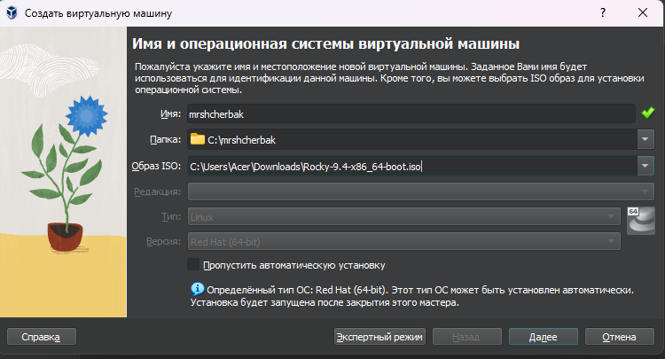

---
## Front matter

title: "Лабораторная работа №8"
subtitle: "Элементы криптографии. Шифрование (кодирование) различных исходных текстов одним ключом"
author: "Щербак Маргарита Романовна, НПИбд-02-21"
date: "2024"
## Generic otions
lang: ru-RU
toc-title: "Содержание"

## Bibliography
bibliography: bib/cite.bib
csl: pandoc/csl/gost-r-7-0-5-2008-numeric.csl

## Pdf output format
toc: true # Table of contents
toc-depth: 2
lof: true # List of figures
fontsize: 12pt
linestretch: 1.5
papersize: a4
documentclass: scrreprt
## I18n polyglossia
polyglossia-lang:
  name: russian
  options:
	- spelling=modern
	- babelshorthands=true
polyglossia-otherlangs:
  name: english
## I18n babel
babel-lang: russian
babel-otherlangs: english
## Fonts
mainfont: PT Serif
romanfont: PT Serif
sansfont: PT Sans
monofont: PT Mono
mainfontoptions: Ligatures=TeX
romanfontoptions: Ligatures=TeX
sansfontoptions: Ligatures=TeX,Scale=MatchLowercase
monofontoptions: Scale=MatchLowercase,Scale=0.9
## Biblatex
biblatex: true
biblio-style: "gost-numeric"
biblatexoptions:
  - parentracker=true
  - backend=biber
  - hyperref=auto
  - language=auto
  - autolang=other*
  - citestyle=gost-numeric

## Pandoc-crossref LaTeX customization
figureTitle: "Скриншот"
tableTitle: "Таблица"
listingTitle: "Листинг"
lofTitle: "Список иллюстраций"
lotTitle: "Список таблиц"
lolTitle: "Листинги"
## Misc options
indent: true
header-includes:
  - \usepackage{indentfirst}
  - \usepackage{float} # keep figures where there are in the text
  - \floatplacement{figure}{H} # keep figures where there are in the text
---

# Цель работы

Освоить на практике применение режима однократного гаммирования на примере кодирования различных исходных текстов одним ключом [1].

# Теоретическое введение 

Информационная безопасность представляет собой защиту данных и поддерживающей инфраструктуры от случайных или преднамеренных воздействий природного или искусственного характера, которые могут нанести ущерб владельцам или пользователям этой информации и инфраструктуры.

# Выполнение лабораторной работы

# Выполнение лабораторной работы

1. Создадим функцию для шифрования и дешифрования, а также импортируем необх. библиотеки. (рис. [-@fig:001])

{ #fig:001 width=80% }

2. Создадим код для выполнения поставленной задачи. (рис. [-@fig:002])

{ #fig:002 width=90% }

# Вывод

Таким образом, в ходе ЛР№1 я освоил на практике применение режима однократного гаммирования на примере кодирования различных исходных текстов одним ключом.

# Контрольные вопросы

1. Как, зная один из текстов (P1 или P2), определить другой, не зная при этом ключа?

Воспользуемся формулой:

C1 (+) C2 (+) P1 = P1 (+) P2 (+) P1 = P2.

C1 и C2 - шифрованные тексты, P1 и P2 - исходные тексты. Ключа K в формуле нет.

2. Что будет при повторном использовании ключа при шифровании текста?

Мы получим исходное сообщение.

3. Как реализуется режим шифрования однократного гаммирования одним ключом двух открытых текстов?

Шифротексты обеих текстов можно получить по формулам режима однократного гаммирования:
C1 = P1 (+) K,
C2 = P2 (+) K.

4. Перечислите недостатки шифрования одним ключом двух открытых текстов.

Можно расшифровать одно из сообщений, зная другое сообщение в открытом виде.

5. Перечислите преимущества шифрования одним ключом двух открытых текстов.

Упрощает дешифровку. Удобен в локальных сетях.

# Библиография

1. Методические материалы курса.

