---
## Front matter
lang: ru-RU
title: Индивидуальный проект. Этап 1
subtitle: Установка Kali Linux
author: |
        Щербак Маргарита Романовна
        \        
        НПИбд-02-21
        \
        Студ. билет: 1032216537
institute: |
           RUDN
date: |
      2024

babel-lang: russian
babel-otherlangs: english
mainfont: Arial
monofont: Courier New
fontsize: 10pt

## Formatting
toc: false
slide_level: 2
theme: metropolis
header-includes: 
 - \metroset{progressbar=frametitle,sectionpage=progressbar,numbering=fraction}
 - '\makeatletter'
 - '\beamer@ignorenonframefalse'
 - '\makeatother'
aspectratio: 43
section-titles: true
---

## Цель работы

Установить дистрибутив Kali Linux в виртуальную машину.

## Теоретическая справка

Kali Linux — это специализированный дистрибутив Linux, разработанный для проведения тестирования на проникновение и анализа информационной безопасности. Он содержит множество предустановленных инструментов для проведения аудитов безопасности, обнаружения уязвимостей и эксплуатации различных системных слабостей.

## Выполнение 1 этапа

Загрузила образ операционной системы с сайта Kali Linux: https://www.kali.org/.

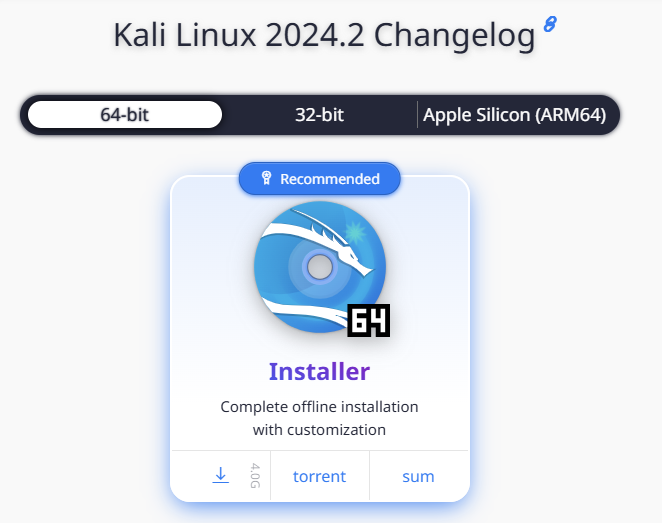{#fig:001 width=60%} 

## Выполнение 1 этапа

Создала новую машину. Далее ввела имя создаваемой виртуальной машины, а также выбрала тип и версию операционной системы.

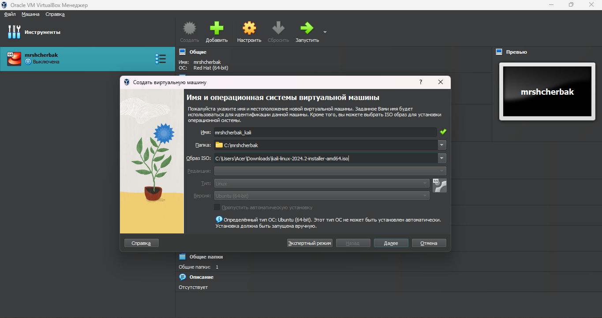{#fig:002 width=80%} 

## Выполнение 1 этапа

Определила объем оперативной памяти, выделяемой для виртуальной машины.

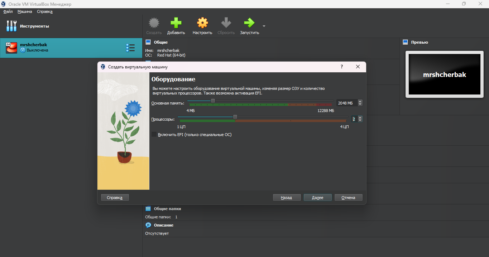{#fig:003 width=80%} 

## Выполнение 1 этапа

Создала виртуальный жесткий диск. Выбрала размер виртуального жесткого диска.

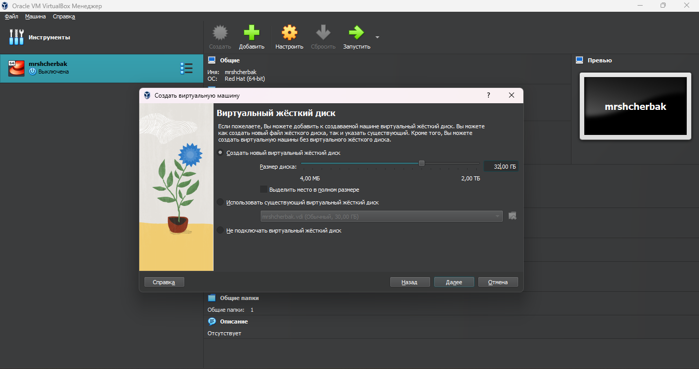{#fig:004 width=80%} 

## Выполнение 1 этапа

Просмотрела итоговые настройки созданной машины.

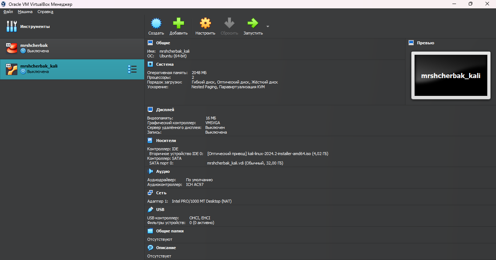{#fig:005 width=80%} 

## Выполнение 1 этапа

Запустила виртуальную машину, выбрала русский язык в качестве языка интерфейса и перешла к настройкам установки операционной системы. 

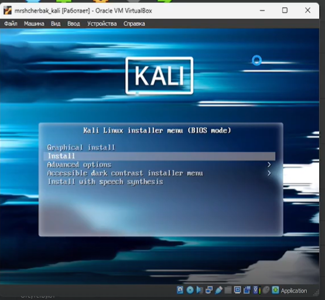{#fig:006 width=50%}

## Выполнение 1 этапа

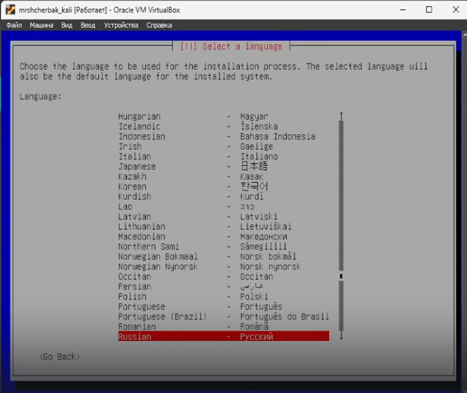{#fig:007 width=70%}

## Выполнение 1 этапа

Ввела имя компьютера - идентификатор системы в сети. Настроила учетные записи пользователей и пароли. Также настроила время.

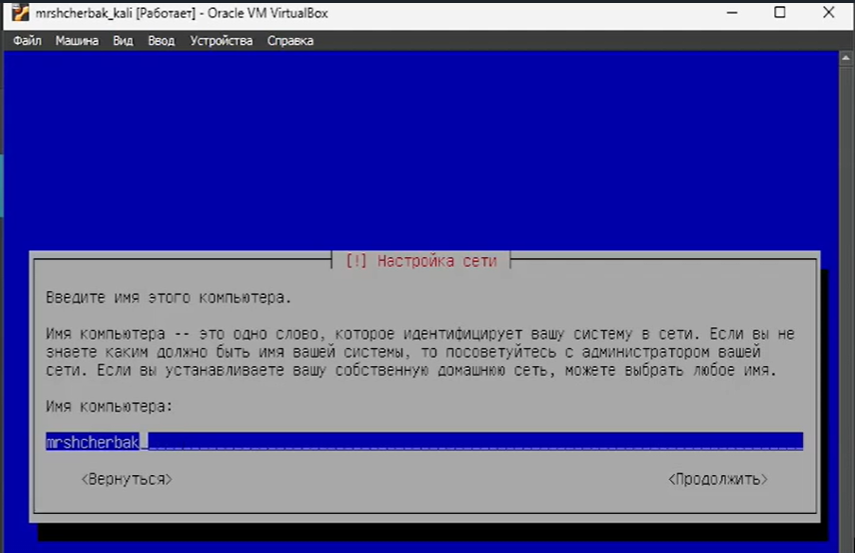{#fig:008 width=70%}

## Выполнение 1 этапа

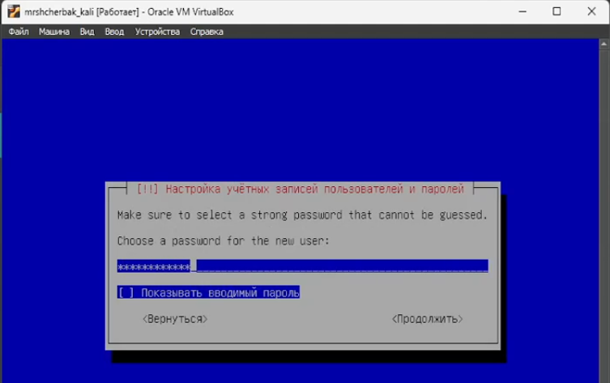{#fig:009 width=90%}

## Выполнение 1 этапа

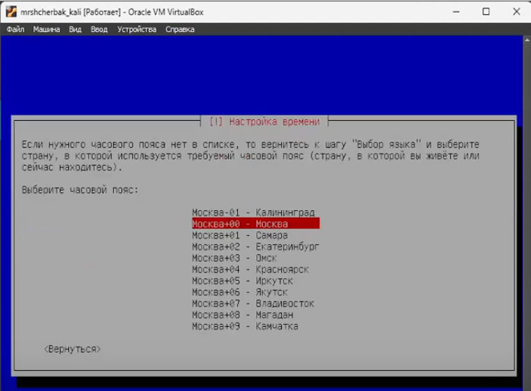{#fig:0010 width=80%}

## Выполнение 1 этапа

Дождавшись загрузки, вошла в систему, введя логин и пароль, которые указывала при настройке учетной записи. Машина готова к использованию.

{#fig:0011 width=60%}

## Выполнение 1 этапа

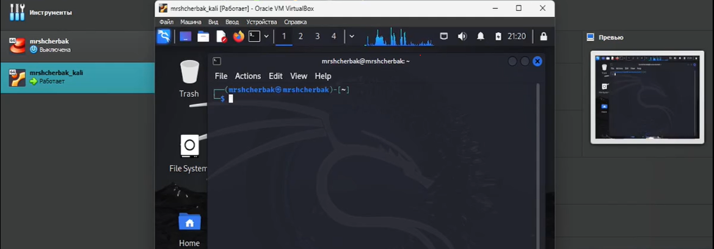{#fig:0012 width=100%}

## Вывод

Таким образом, в ходе 1 этапа индивидуального проекта я приобрела практические навыки установки операционной системы на виртуальную машину и настройки минимально необходимых для дальнейшей работы сервисов.

## Библиография

1. Документация по Virtual Box: https://www.virtualbox.org/wiki/Documentation
2. Документация по этапам индивидульного проекта: Парасрам Шива, Замм Алекс, Хериянто Теди, Али Шакил, Буду Дамиан, 
Йохансен Джерард, Аллен Ли П18 Kali Linux. Тестирование на проникновение и безопасность. — СПб.: Питер, 2020. — 448 с.: 
ил. — (Серия «Для профессионалов»). ISBN 978-5-4461-1252-4
