---
## Front matter

title: "Отчёт о выполнении. Индивидуальный проект. Этап 1"
subtitle: "Установка Kali Linux"
author: "Щербак Маргарита Романовна, НПИбд-02-21"
date: "2024"
## Generic otions
lang: ru-RU
toc-title: "Содержание"

## Bibliography
bibliography: bib/cite.bib
csl: pandoc/csl/gost-r-7-0-5-2008-numeric.csl

## Pdf output format
toc: true # Table of contents
toc-depth: 2
lof: true # List of figures
fontsize: 12pt
linestretch: 1.5
papersize: a4
documentclass: scrreprt
## I18n polyglossia
polyglossia-lang:
  name: russian
  options:
	- spelling=modern
	- babelshorthands=true
polyglossia-otherlangs:
  name: english
## I18n babel
babel-lang: russian
babel-otherlangs: english
## Fonts
mainfont: PT Serif
romanfont: PT Serif
sansfont: PT Sans
monofont: PT Mono
mainfontoptions: Ligatures=TeX
romanfontoptions: Ligatures=TeX
sansfontoptions: Ligatures=TeX,Scale=MatchLowercase
monofontoptions: Scale=MatchLowercase,Scale=0.9
## Biblatex
biblatex: true
biblio-style: "gost-numeric"
biblatexoptions:
  - parentracker=true
  - backend=biber
  - hyperref=auto
  - language=auto
  - autolang=other*
  - citestyle=gost-numeric

## Pandoc-crossref LaTeX customization
figureTitle: "Скриншот"
tableTitle: "Таблица"
listingTitle: "Листинг"
lofTitle: "Список иллюстраций"
lotTitle: "Список таблиц"
lolTitle: "Листинги"
## Misc options
indent: true
header-includes:
  - \usepackage{indentfirst}
  - \usepackage{float} # keep figures where there are in the text
  - \floatplacement{figure}{H} # keep figures where there are in the text
---

# Цель работы

Установить дистрибутив Kali Linux в виртуальную машину.

# Теоретическое введение 

Виртуализация является одним из ключевых инструментов в современной информационной безопасности и IT-инфраструктуре. Использование виртуальных машин (VM) позволяет создавать изолированные среды для работы, тестирования и изучения различных операционных систем и программного обеспечения без риска воздействия на основную систему. Одним из наиболее популярных дистрибутивов, используемых для задач информационной безопасности, является Kali Linux [1].

Kali Linux — это специализированный дистрибутив Linux, разработанный для проведения тестирования на проникновение и анализа информационной безопасности. Он содержит множество предустановленных инструментов для проведения аудитов безопасности, обнаружения уязвимостей и эксплуатации различных системных слабостей [2].

# Выполнение проекта

1.  Загрузила образ операционной системы с сайта Kali Linux: https://www.kali.org/ (рис.1).

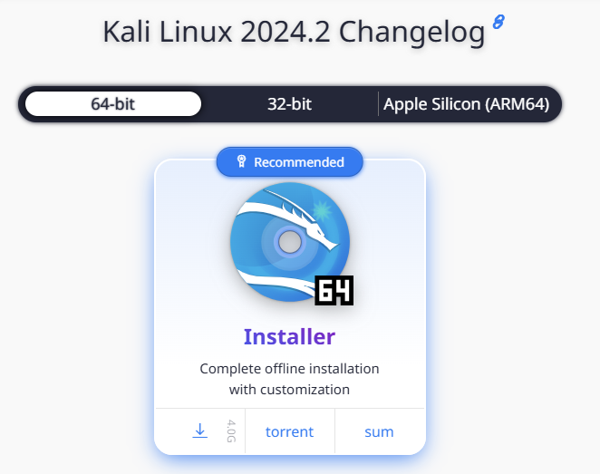{#fig:001 width=90%} 

2. Создала новую машину. Далее ввела имя создаваемой виртуальной машины, а также выбрала тип и версию операционной системы (рис.2).

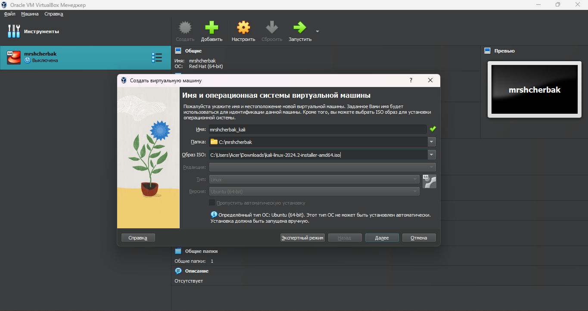{#fig:002 width=100%} 

3. Определила объем оперативной памяти, выделяемой для виртуальной машины (рис.3).

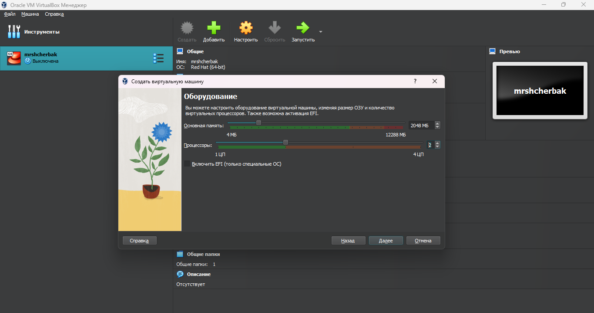{#fig:003 width=100%} 

4. Создала виртуальный жесткий диск. Выбрала размер виртуального жесткого диска (рис.4).

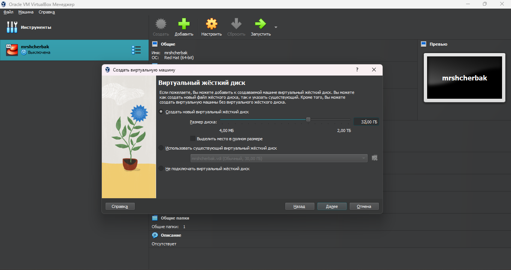{#fig:004 width=100%} 

5. Просмотрела итоговые настройки созданной машины (рис.5).

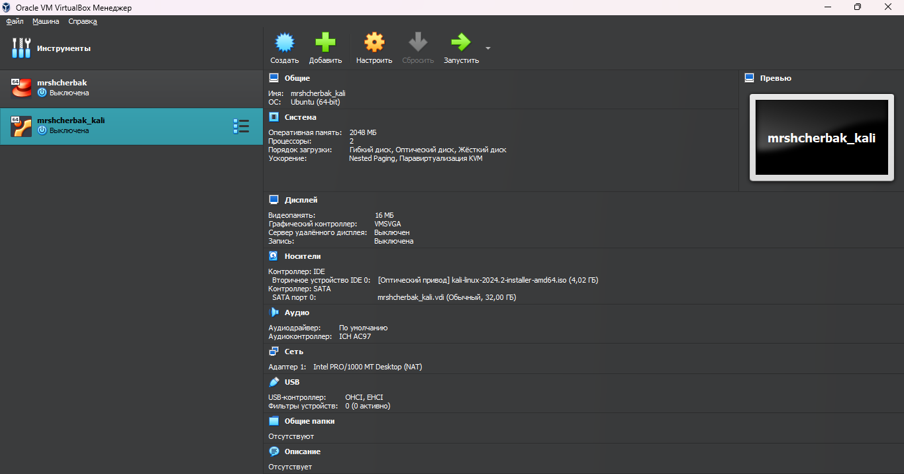{#fig:005 width=100%} 

6. Запустила виртуальную машину (рис.6), выбрала русский язык в качестве языка интерфейса (рис.7) и перешла к настройкам установки операционной системы. 

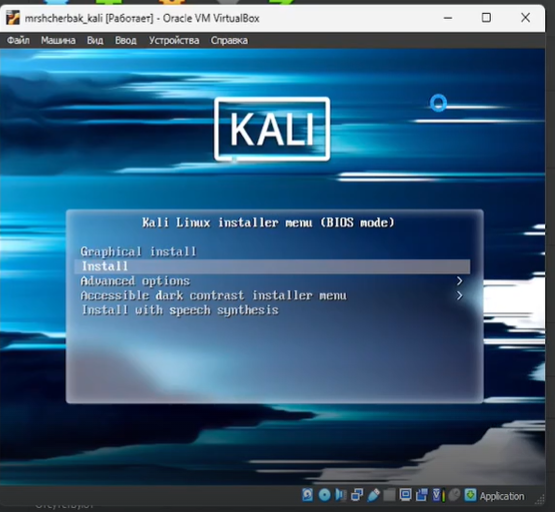{#fig:006 width=100%}

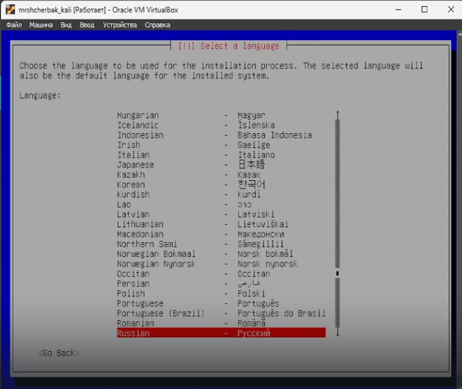{#fig:007 width=100%}

7. Ввела имя компьютера - идентификатор системы в сети (рис.8). Настроила учетные записи пользователей и пароли (рис.9). Также настроила время (рис.10).

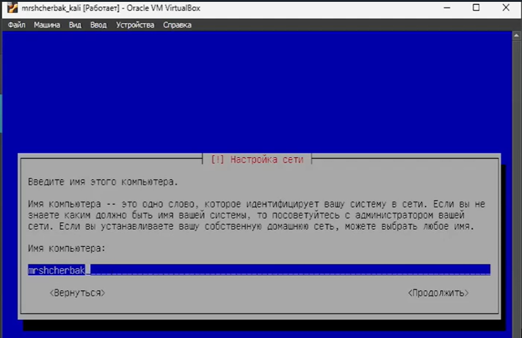{#fig:008 width=100%}

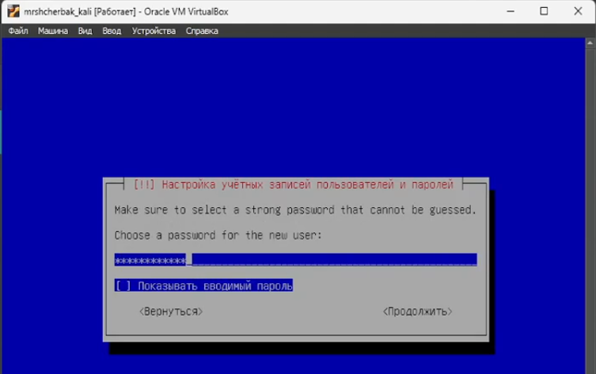{#fig:009 width=100%}

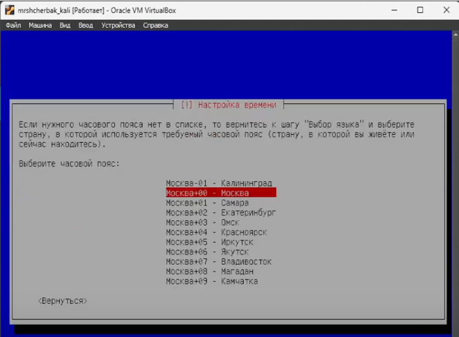{#fig:0010 width=100%}

4. Дождавшись загрузки, вошла в систему, введя логин и пароль, которые указывала при настройке учетной записи (рис.11). Машина готова к использованию (рис.12).

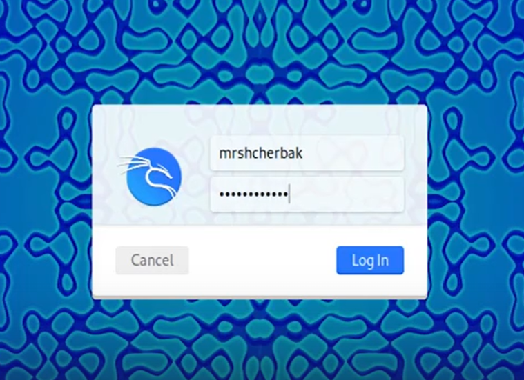{#fig:0011 width=100%}

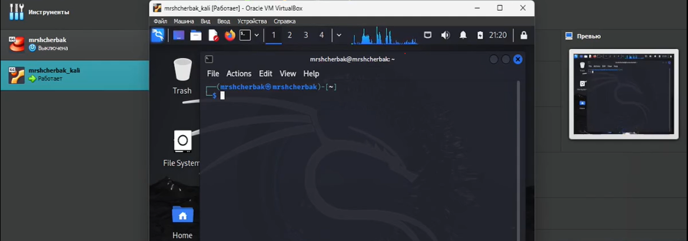{#fig:0012 width=100%}

# Вывод
Таким образом, в ходе 1 этапа индивидуального проекта я приобрела практические навыки установки операционной системы на виртуальную машину и настройки минимально необходимых для дальнейшей работы сервисов.

# Библиография

1. Документация по Virtual Box: https://www.virtualbox.org/wiki/Documentation
2. Документация по этапам индивидульного проекта: Парасрам Шива, Замм Алекс, Хериянто Теди, Али Шакил, Буду Дамиан, 
Йохансен Джерард, Аллен Ли П18 Kali Linux. Тестирование на проникновение и безопасность. — СПб.: Питер, 2020. — 448 с.: 
ил. — (Серия «Для профессионалов»). ISBN 978-5-4461-1252-4
