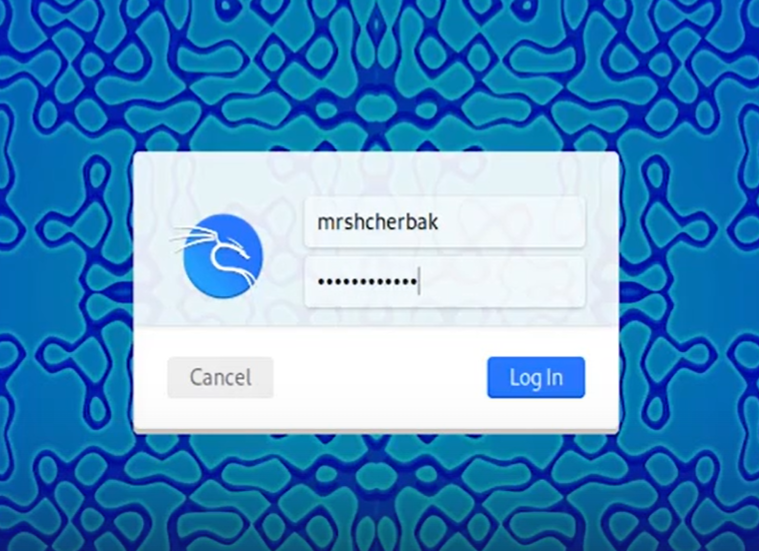
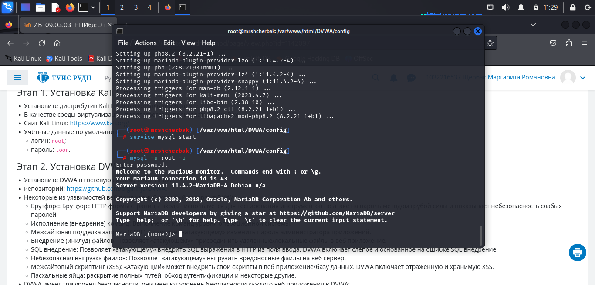

---
## Front matter
lang: ru-RU
title: Индивидуальный проект. Этап 2
subtitle: Установка DVWA
author: |
        Щербак Маргарита Романовна
        \        
        НПИбд-02-21
        \
        Студ. билет: 1032216537
institute: |
           RUDN
date: |
      2024

babel-lang: russian
babel-otherlangs: english
mainfont: Arial
monofont: Courier New
fontsize: 10pt

## Formatting
toc: false
slide_level: 2
theme: metropolis
header-includes: 
 - \metroset{progressbar=frametitle,sectionpage=progressbar,numbering=fraction}
 - '\makeatletter'
 - '\beamer@ignorenonframefalse'
 - '\makeatother'
aspectratio: 43
section-titles: true
---

## Цель работы

Установить DVWA в гостевую систему к Kali Linux.

## Теоретическая справка

Kali Linux — это специализированный дистрибутив Linux, разработанный для проведения тестирования на проникновение и анализа информационной безопасности. Он содержит множество предустановленных инструментов для проведения аудитов безопасности, обнаружения уязвимостей и эксплуатации различных системных слабостей.

## Выполнение 2 этапа
Запустила виртуальную машину и ввела пароль и логин для входа в систему (рис.1).

{#fig:001 width=70%}

## Выполнение 2 этапа
Открыла терминал (рис.2).

{#fig:002 width=95%}

## Выполнение 2 этапа
Перешла в папку /var/www/html и от имени администратора клонировала репозиторий git hub. Изменила права доступа к папке установки (рис.3).

{#fig:003 width=85%}

## Выполнение 2 этапа
Перешла к файлу конфигурации в каталоге установки, скопировала файл конфигурации и переименовала его. Установила mariadb (рис.4). Содержимое файла config.inc.php представлено на рис.5.

{#fig:004 width=85%}

## Выполнение 2 этапа

{#fig:006 width=100%}

## Выполнение 2 этапа
Запустила базу данных и вошла в нее (рис.6).

{#fig:007 width=90%}

## Выполнение 2 этапа
Создала пользователя базы данных. Нужно использовать те же имя пользователя и пароль, которые использовались в файле конфигурации (рис.7).

{#fig:008 width=90%}

## Выполнение 2 этапа
Открыла для редактирования файл php.ini, чтобы включить следующие параметры: allow_url_fopen и allow_url_include (рис.8).

{#fig:009 width=90%}

## Выполнение 2 этапа
Запустила сервер Apache и открыла DVWA в браузере для проверки работы сервера (рис.9).

{#fig:0010 width=90%}

## Вывод

Таким образом, в ходе 2 этапа индивидуального проекта я установила DVWA в гостевую систему к Kali Linux.

## Библиография

1. Документация по Virtual Box: https://www.virtualbox.org/wiki/Documentation
2. Документация по этапам индивидульного проекта: Парасрам Шива, Замм Алекс, Хериянто Теди, Али Шакил, Буду Дамиан, 
Йохансен Джерард, Аллен Ли П18 Kali Linux. Тестирование на проникновение и безопасность. — СПб.: Питер, 2020. — 448 с.: 
ил. — (Серия «Для профессионалов»). ISBN 978-5-4461-1252-4
