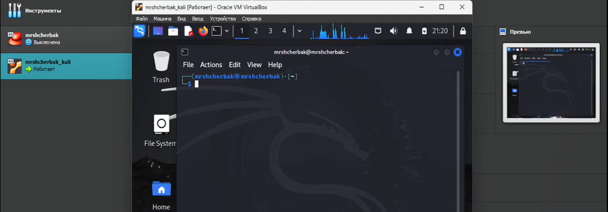
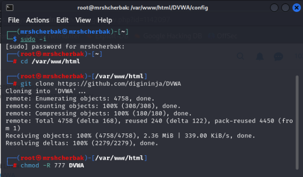
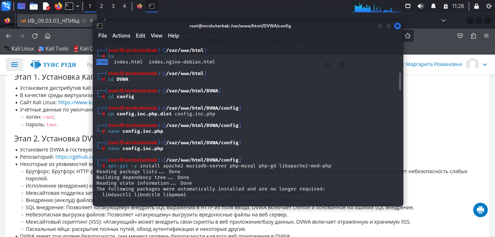

---
## Front matter

title: "Отчёт о выполнении. Индивидуальный проект. Этап 2"
subtitle: "Установка DVWA"
author: "Щербак Маргарита Романовна, НПИбд-02-21"
date: "2024"
## Generic otions
lang: ru-RU
toc-title: "Содержание"

## Bibliography
bibliography: bib/cite.bib
csl: pandoc/csl/gost-r-7-0-5-2008-numeric.csl

## Pdf output format
toc: true # Table of contents
toc-depth: 2
lof: true # List of figures
fontsize: 12pt
linestretch: 1.5
papersize: a4
documentclass: scrreprt
## I18n polyglossia
polyglossia-lang:
  name: russian
  options:
	- spelling=modern
	- babelshorthands=true
polyglossia-otherlangs:
  name: english
## I18n babel
babel-lang: russian
babel-otherlangs: english
## Fonts
mainfont: PT Serif
romanfont: PT Serif
sansfont: PT Sans
monofont: PT Mono
mainfontoptions: Ligatures=TeX
romanfontoptions: Ligatures=TeX
sansfontoptions: Ligatures=TeX,Scale=MatchLowercase
monofontoptions: Scale=MatchLowercase,Scale=0.9
## Biblatex
biblatex: true
biblio-style: "gost-numeric"
biblatexoptions:
  - parentracker=true
  - backend=biber
  - hyperref=auto
  - language=auto
  - autolang=other*
  - citestyle=gost-numeric

## Pandoc-crossref LaTeX customization
figureTitle: "Скриншот"
tableTitle: "Таблица"
listingTitle: "Листинг"
lofTitle: "Список иллюстраций"
lotTitle: "Список таблиц"
lolTitle: "Листинги"
## Misc options
indent: true
header-includes:
  - \usepackage{indentfirst}
  - \usepackage{float} # keep figures where there are in the text
  - \floatplacement{figure}{H} # keep figures where there are in the text
---

# Цель работы

Установить DVWA в гостевую систему к Kali Linux.

# Теоретическое введение 

Виртуализация является одним из ключевых инструментов в современной информационной безопасности и IT-инфраструктуре. Использование виртуальных машин (VM) позволяет создавать изолированные среды для работы, тестирования и изучения различных операционных систем и программного обеспечения без риска воздействия на основную систему. Одним из наиболее популярных дистрибутивов, используемых для задач информационной безопасности, является Kali Linux [1].

Kali Linux — это специализированный дистрибутив Linux, разработанный для проведения тестирования на проникновение и анализа информационной безопасности. Он содержит множество инструментов для проведения аудитов безопасности, обнаружения уязвимостей и эксплуатации различных системных слабостей [2].

Некоторые из уязвимостей веб приложений, который содержит DVWA:  
- Брутфорс: Брутфорс HTTP формы страницы входа - используется для тестирования инструментов по атаке на пароль методом грубой силы и показывает небезопасность слабых паролей.  
- Исполнение (внедрение) команд: Выполнение команд уровня операционной системы.  
- Межсайтовая подделка запроса (CSRF): Позволяет «атакующему» изменить пароль администратора приложений.  
- Внедрение (инклуд) файлов: Позволяет «атакующему» присоединить удалённые/локальные файлы в веб приложение.  
- SQL внедрение: Позволяет «атакующему» внедрить SQL выражения в HTTP из поля ввода, DVWA включает слепое и основанное на ошибке SQL внедрение.  
- Небезопасная выгрузка файлов: Позволяет «атакующему» выгрузить вредоносные файлы на веб сервер.  
- Межсайтовый скриптинг (XSS): «Атакующий» может внедрить свои скрипты в веб приложение/базу данных. DVWA включает отражённую и хранимую XSS.  
- Пасхальные яйца: раскрытие полных путей, обход аутентификации и некоторые другие.

DVWA имеет три уровня безопасности, они меняют уровень безопасности каждого веб приложения в DVWA:  
- Невозможный — этот уровень должен быть безопасным от всех уязвимостей. Он используется для сравнения уязвимого исходного кода с безопасным исходным кодом.  
- Высокий — это расширение среднего уровня сложности, со смесью более сложных или альтернативных плохих практик в попытке обезопасить код. Уязвимости не позволяют такой простор эксплуатации как на других уровнях.  
- Средний — этот уровень безопасности предназначен главным образом для того, чтобы дать пользователю пример плохих практик безопасности, где разработчик попытался сделать приложение безопасным, но потерпел неудачу.  
- Низкий — этот уровень безопасности совершенно уязвим и совсем не имеет защиты. Его предназначение быть примером среди уязвимых веб приложений, примером плохих практик программирования и служить платформой обучения базовым техникам эксплуатации.

# Выполнение проекта

1. Запустила виртуальную машину и ввела пароль и логин для входа в систему (рис.1).

{#fig:001 width=90%}

2. Открыла терминал (рис.2).

{#fig:002 width=100%}

3. Перешла в папку /var/www/html и от имени администратора клонировала репозиторий git hub. Изменила права доступа к папке установки (рис.3).

{#fig:003 width=100%}

4. Перешла к файлу конфигурации в каталоге установки, скопировала файл конфигурации и переименовала его. Установила mariadb (рис.4). Содержимое файла config.inc.php представлено на рис.5.

{#fig:004 width=100%}

{#fig:006 width=100%}

5. Запустила базу данных и вошла в нее (рис.6).

{#fig:007 width=100%}

6. Создала пользователя базы данных. Нужно использовать те же имя пользователя и пароль, которые использовались в файле конфигурации (рис.7).

{#fig:008 width=90%}

7. Открыла для редактирования файл php.ini, чтобы включить следующие параметры: allow_url_fopen и allow_url_include (рис.8).

{#fig:009 width=100%}

8. Запустила сервер Apache и открыла DVWA в браузере для проверки работы сервера (рис.9).

{#fig:0010 width=100%}

# Вывод

Таким образом, в ходе 2 этапа индивидуального проекта я установила DVWA в гостевую систему к Kali Linux.

# Библиография

1. Документация по Virtual Box: https://www.virtualbox.org/wiki/Documentation
2. Документация по этапам индивидульного проекта: Парасрам Шива, Замм Алекс, Хериянто Теди, Али Шакил, Буду Дамиан, 
Йохансен Джерард, Аллен Ли П18 Kali Linux. Тестирование на проникновение и безопасность. — СПб.: Питер, 2020. — 448 с.: 
ил. — (Серия «Для профессионалов»). ISBN 978-5-4461-1252-4
