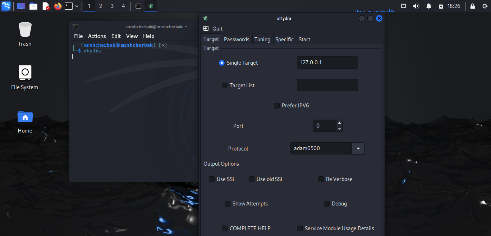

---
## Front matter
lang: ru-RU
title: Индивидуальный проект. Этап 3
subtitle: Использование Hydra
author: |
        Щербак Маргарита Романовна
        \        
        НПИбд-02-21
        \
        Студ. билет: 1032216537
institute: |
           RUDN
date: |
      2024

babel-lang: russian
babel-otherlangs: english
mainfont: Arial
monofont: Courier New
fontsize: 10pt

## Formatting
toc: false
slide_level: 2
theme: metropolis
header-includes: 
 - \metroset{progressbar=frametitle,sectionpage=progressbar,numbering=fraction}
 - '\makeatletter'
 - '\beamer@ignorenonframefalse'
 - '\makeatother'
aspectratio: 43
section-titles: true
---

## Цель работы

Приобретение практических навыков по использованию инструмента Hydra.

## Теоретическая справка

Kali Linux — это специализированный дистрибутив Linux, разработанный для проведения тестирования на проникновение и анализа информационной безопасности. Он содержит множество предустановленных инструментов для проведения аудитов безопасности, обнаружения уязвимостей и эксплуатации различных системных слабостей.

## Выполнение 3 этапа. Запуск Hydra

Через терминал запустила Hydra, для графической версии добавила 'x' перед командой. Просмотрела и изучила вкладки (рис.1 - рис.2).

{ #fig:001 width=80% height=80% }

## Выполнение 3 этапа

{ #fig:002 width=80% height=100% }

## Выполнение 3 этапа

Чтобы пробрутфорсить пароль, нужно иметь список паролей. Список частоиспользуемых паролей можно найти в открытых источниках, я взяла список паролей `rockyou.txt` для kali linux (рис. 3). 

{#fig:003 width=80%}

## Выполнение 3 этапа

Зашла на сайт DVWA. Для запроса hydra нужны параметры cookie с этого сайта (рис. 4).
 
{#fig:004 width=80%}

## Выполнение 3 этапа

Ввожу в Hydra запрос нужную информацию. Пароль будем подбирать для пользователя admin, используем GET-запрос с двумя параметрами cookie: безопасность и PHPSESSID (рис. 5).

{#fig:005 width=80%}

## Выполнение 3 этапа

Получили результат с подходящим паролем (admin, password). Ввела полученные данные на сайт для проверки и получила положительный результат проверки пароля (рис. 6).

{#fig:006 width=80%}

## Вывод

Таким образом, в ходе 3 этапа индивидуального проекта я приобрела практические навыки по использованию инструмента Hydra.

## Библиография

1. Документация по Virtual Box: https://www.virtualbox.org/wiki/Documentation
2. Документация по этапам индивидульного проекта: Парасрам Шива, Замм Алекс, Хериянто Теди, Али Шакил, Буду Дамиан, 
Йохансен Джерард, Аллен Ли П18 Kali Linux. Тестирование на проникновение и безопасность. — СПб.: Питер, 2020. — 448 с.: 
ил. — (Серия «Для профессионалов»). ISBN 978-5-4461-1252-4
