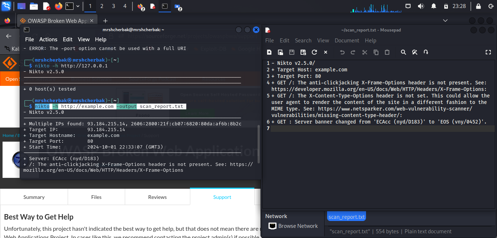

---
## Front matter
lang: ru-RU
title: Индивидуальный проект. Этап 4
subtitle: Использование nikto
author: |
        Щербак Маргарита Романовна
        \        
        НПИбд-02-21
        \
        Студ. билет: 1032216537
institute: |
           RUDN
date: |
      2024

babel-lang: russian
babel-otherlangs: english
mainfont: Arial
monofont: Courier New
fontsize: 10pt

## Formatting
toc: false
slide_level: 2
theme: metropolis
header-includes: 
 - \metroset{progressbar=frametitle,sectionpage=progressbar,numbering=fraction}
 - '\makeatletter'
 - '\beamer@ignorenonframefalse'
 - '\makeatother'
aspectratio: 43
section-titles: true
---

## **Цель работы**

Научиться использовать nikto.

## **Теоретическая справка**

nikto — базовый сканер безопасности веб-сервера. Он сканирует и обнаруживает уязвимости в веб-приложениях, обычно вызванные неправильной конфигурацией на самом сервере, файлами, установленными по умолчанию, и небезопасными файлами, а также устаревшими серверными приложениями.

## **Выполнение лабораторной работы** 

Nikto можно установить с помощью команды: sudo apt install nikto -y. Для сканирования внешнего веб-сервера выполнила команду: nikto -h http://example.com. 

{ #fig:001 width=100% height=100% }

## **Выполнение лабораторной работы** 

Для сохранения отчета в файл можно использовать команду: nikto -h http://127.0.0.1 -output nikto_report.txt. Для сканирования выбрала локальный сервер. 

{ #fig:002 width=100% height=100% }

## **Выполнение лабораторной работы** 

На основе выявленных уязвимостей можно увидеть возможные проблемы с безопасностью сервера, которые нужно устранить. Например:

- Включить заголовки безопасности (X-Frame-Options, X-Content-Type-Options).
- Закрыть доступ к служебным файлам или интерфейсам администратора.
- Обновить устаревшие версии серверного ПО.

##  Вывод

Таким образом, в ходе 4 этапа индивидуального проекта я научилась использовать nikto. Демонстрация Nikto на виртуальной машине Kali Linux позволяет показать, как можно анализировать безопасность веб-сервера и находить потенциальные уязвимости, такие как неправильные настройки серверов, устаревшее ПО или отсутствующие заголовки безопасности.

## Библиография

- Методические материалы курса.
- Rocky Linux Documentation. [Электронный ресурс]. М. URL: [Rocky Linux Documentation](https://docs.rockylinux.org) (Дата обращения: 01.10.2024).

