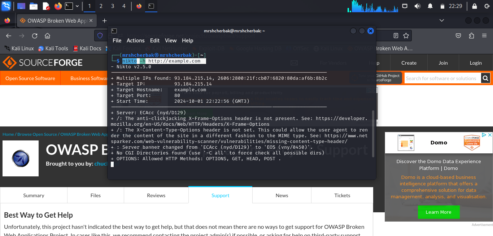
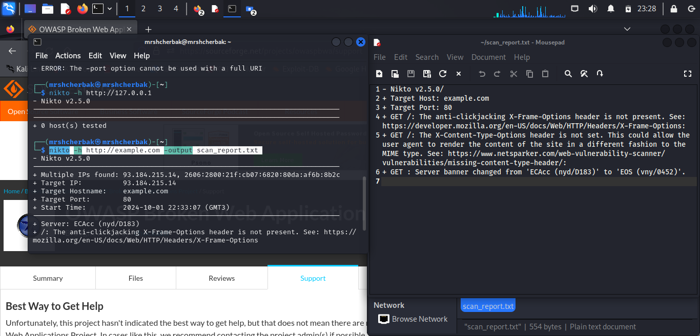

---
## Front matter

title: "Отчёт о выполнении. Индивидуальный проект. Этап 4"
subtitle: "Использование nikto"
author: "Щербак Маргарита Романовна, НПИбд-02-21"
date: "2024"
## Generic otions
lang: ru-RU
toc-title: "Содержание"

## Bibliography
bibliography: bib/cite.bib
csl: pandoc/csl/gost-r-7-0-5-2008-numeric.csl

## Pdf output format
toc: true # Table of contents
toc-depth: 2
lof: true # List of figures
fontsize: 12pt
linestretch: 1.5
papersize: a4
documentclass: scrreprt
## I18n polyglossia
polyglossia-lang:
  name: russian
  options:
	- spelling=modern
	- babelshorthands=true
polyglossia-otherlangs:
  name: english
## I18n babel
babel-lang: russian
babel-otherlangs: english
## Fonts
mainfont: PT Serif
romanfont: PT Serif
sansfont: PT Sans
monofont: PT Mono
mainfontoptions: Ligatures=TeX
romanfontoptions: Ligatures=TeX
sansfontoptions: Ligatures=TeX,Scale=MatchLowercase
monofontoptions: Scale=MatchLowercase,Scale=0.9
## Biblatex
biblatex: true
biblio-style: "gost-numeric"
biblatexoptions:
  - parentracker=true
  - backend=biber
  - hyperref=auto
  - language=auto
  - autolang=other*
  - citestyle=gost-numeric

## Pandoc-crossref LaTeX customization
figureTitle: "Скриншот"
tableTitle: "Таблица"
listingTitle: "Листинг"
lofTitle: "Список иллюстраций"
lotTitle: "Список таблиц"
lolTitle: "Листинги"
## Misc options
indent: true
header-includes:
  - \usepackage{indentfirst}
  - \usepackage{float} # keep figures where there are in the text
  - \floatplacement{figure}{H} # keep figures where there are in the text
---

# Цель работы

Научиться использовать nikto.

# Теоретическое введение 

Информационная безопасность представляет собой защиту данных и поддерживающей инфраструктуры от случайных или преднамеренных воздействий природного или искусственного характера, которые могут нанести ущерб владельцам или пользователям этой информации и инфраструктуры [1].

Rocky Linux — это дистрибутив Linux, созданный Rocky Enterprise Software Foundation. Он задуман как полностью двоично-совместимый релиз, основанный на исходном коде операционной системы Red Hat Enterprise Linux (RHEL). Цель проекта — обеспечить сообщество корпоративной операционной системой производственного уровня, поддерживаемой сообществом. Rocky Linux наряду с Red Hat Enterprise Linux и SUSE Linux Enterprise стал популярен среди корпоративных пользователей [2].

nikto — базовый сканер безопасности веб-сервера. Он сканирует и обнаруживает уязвимости в веб-приложениях, обычно вызванные неправильной конфигурацией на самом сервере, файлами, установленными по умолчанию, и небезопасными файлами, а также устаревшими серверными приложениями.

# Выполнение лабораторной работы

Nikto можно установить с помощью команды: sudo apt install nikto -y. Для сканирования внешнего веб-сервера выполнила команду: nikto -h http://example.com. В результате получила версию инструмента Nikto, IP-адрес целевого сервера, имя хоста, порт, на котором работает веб-сервер, информацию о сервере, которую смог получить Nikto, время начала сканирования. Далее вывод может содержать потенциальные уязвимости и интересные наблюдения:

- The anti-clickjacking X-Frame-Options header is not present: Заголовок X-Frame-Options отсутствует, что может сделать веб-приложение уязвимым для атак clickjacking.
- X-Content-Type-Options header missing: Отсутствие заголовка X-Content-Type-Options, который может предотвратить некоторые типы атак, связанных с MIME-типами.
- Allowed HTTP Methods: Перечислены разрешённые HTTP-методы (GET, HEAD, POST, OPTIONS), некоторые из которых могут быть использованы злоумышленниками при атаках.
- Retrieved x-powered-by header: Сервер вернул заголовок x-powered-by, показывающий, что сервер работает на PHP версии 7.4.3. Это может быть полезно злоумышленникам для поиска уязвимостей в этой версии PHP.
- OSVDB-3092: Уведомление о том, что на пути /admin/ может находиться интерфейс администратора, который потенциально уязвим.
- OSVDB-3268: Включён индекс каталогов на пути /cgi-bin/, что может дать злоумышленникам доступ к служебным файлам.
- OSVDB-0E01: Обнаружен phpMyAdmin на пути /phpmyadmin/, который может быть устаревшим и уязвимым к атакам.

{ #fig:001 width=100% height=100% }

Для сохранения отчета в файл можно использовать команду: nikto -h http://127.0.0.1 -output nikto_report.txt. Для сканирования выбрала локальный сервер. 

{ #fig:002 width=100% height=100% }

На основе выявленных уязвимостей можно увидеть возможные проблемы с безопасностью сервера, которые нужно устранить. Например:

- Включить заголовки безопасности (X-Frame-Options, X-Content-Type-Options).
- Закрыть доступ к служебным файлам или интерфейсам администратора.
- Обновить устаревшие версии серверного ПО.

# Вывод
Таким образом, в ходе 4 этапа индивидуального проекта я научилась использовать nikto. Демонстрация Nikto на виртуальной машине Kali Linux позволяет показать, как можно анализировать безопасность веб-сервера и находить потенциальные уязвимости, такие как неправильные настройки серверов, устаревшее ПО или отсутствующие заголовки безопасности.

# Библиография

- Методические материалы курса.
- Rocky Linux Documentation. [Электронный ресурс]. М. URL: [Rocky Linux Documentation](https://docs.rockylinux.org) (Дата обращения: 03.09.2024).
