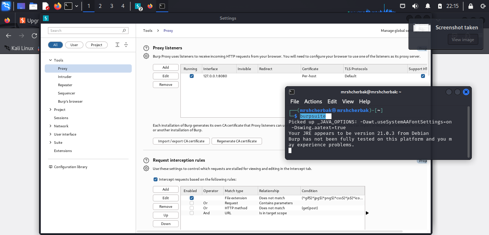
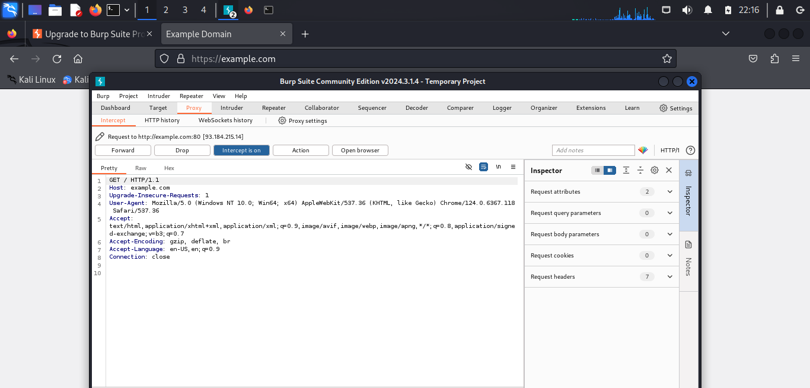
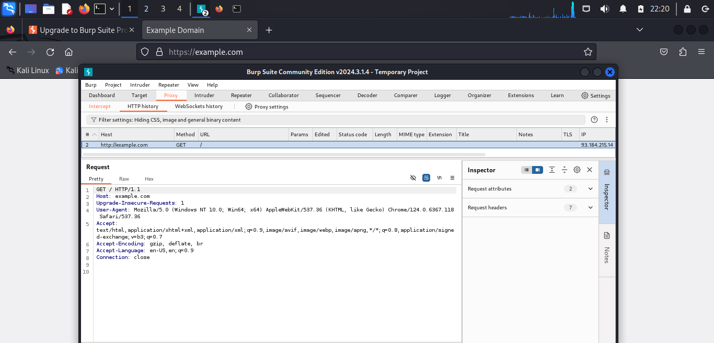

---
## Front matter
lang: ru-RU
title: Индивидуальный проект. Этап 5
subtitle: Использование Burp Suite
author: |
        Щербак Маргарита Романовна
        \        
        НПИбд-02-21
        \
        Студ. билет: 1032216537
institute: |
           RUDN
date: |
      2024

babel-lang: russian
babel-otherlangs: english
mainfont: Arial
monofont: Courier New
fontsize: 10pt

## Formatting
toc: false
slide_level: 2
theme: metropolis
header-includes: 
 - \metroset{progressbar=frametitle,sectionpage=progressbar,numbering=fraction}
 - '\makeatletter'
 - '\beamer@ignorenonframefalse'
 - '\makeatother'
aspectratio: 43
section-titles: true
---

## **Цель работы**
Научиться использовать Burp Suite.

## **Теоретическая справка**
Burp Suite представляет собой набор мощных инструментов безопасности веб-приложений, которые демонстрируют реальные возможности злоумышленника, проникающего в веб-приложения. Эти инструменты позволяют сканировать, анализировать и 
использовать веб-приложения с помощью ручных и автоматических методов. Интеграция интерфейсов этих инструментов 
обеспечивает полную платформу атаки для обмена информацией между одним или несколькими инструментами, что делает 
Burp Suite очень эффективной и простой в использовании платформой для атаки веб-приложений.

## **Выполнение лабораторной работы** 

Я открыла Burp Suite, перешла во вкладку Proxy > Options. Убедилась, что Burp Suite слушает на порту 8080 (локальный адрес 127.0.0.1) (рис.1). 

{ #fig:001 width=100% height=100% }

## **Выполнение лабораторной работы** 

После настройки прокси-сервера, открыла браузер и перешла на сайт http://example.com. Burp Suite начал перехватывать запросы. 

{ #fig:002 width=100% height=100% }

## **Выполнение лабораторной работы** 
Использование других инструментов Burp Suite:  
- Intruder: используется для проведения атак с перебором параметров (например, перебор паролей или идентификаторов сессий).  
- Scanner (в профессиональной версии): автоматически сканирует веб-приложение на уязвимости, такие как SQL-инъекции или XSS.

## **Выполнение лабораторной работы** 
В HTTP History во вкладке Proxy можно просмотреть полный список запросов и ответов, которые прошли через Burp Suite (рис.3).  

{ #fig:003 width=100% height=100% }

## Вывод

Таким образом, в ходе 5 этапа индивидуального проекта я научилась использовать Burp Suite. Инструменты Burp Suite позволяют исследовать и тестировать веб-приложения на уязвимости. Эти демонстрации помогают понять, как злоумышленники могут модифицировать запросы или перебирать параметры, чтобы скомпрометировать веб-приложение.

## Библиография

- Методические материалы курса.
- Rocky Linux Documentation. [Электронный ресурс]. М. URL: [Rocky Linux Documentation](https://docs.rockylinux.org) (Дата обращения: 01.10.2024).

