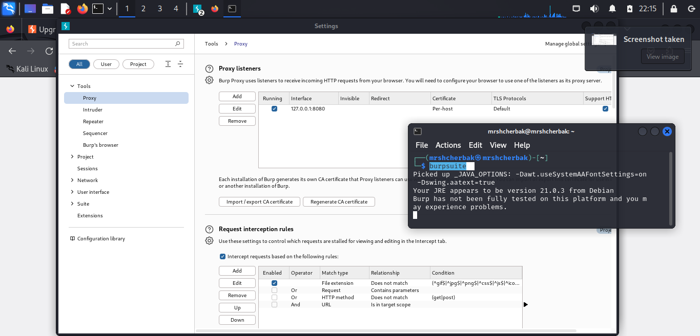

---
## Front matter

title: "Отчёт о выполнении. Индивидуальный проект. Этап 5"
subtitle: "Использование Burp Suite"
author: "Щербак Маргарита Романовна, НПИбд-02-21"
date: "2024"
## Generic otions
lang: ru-RU
toc-title: "Содержание"

## Bibliography
bibliography: bib/cite.bib
csl: pandoc/csl/gost-r-7-0-5-2008-numeric.csl

## Pdf output format
toc: true # Table of contents
toc-depth: 2
lof: true # List of figures
fontsize: 12pt
linestretch: 1.5
papersize: a4
documentclass: scrreprt
## I18n polyglossia
polyglossia-lang:
  name: russian
  options:
	- spelling=modern
	- babelshorthands=true
polyglossia-otherlangs:
  name: english
## I18n babel
babel-lang: russian
babel-otherlangs: english
## Fonts
mainfont: PT Serif
romanfont: PT Serif
sansfont: PT Sans
monofont: PT Mono
mainfontoptions: Ligatures=TeX
romanfontoptions: Ligatures=TeX
sansfontoptions: Ligatures=TeX,Scale=MatchLowercase
monofontoptions: Scale=MatchLowercase,Scale=0.9
## Biblatex
biblatex: true
biblio-style: "gost-numeric"
biblatexoptions:
  - parentracker=true
  - backend=biber
  - hyperref=auto
  - language=auto
  - autolang=other*
  - citestyle=gost-numeric

## Pandoc-crossref LaTeX customization
figureTitle: "Скриншот"
tableTitle: "Таблица"
listingTitle: "Листинг"
lofTitle: "Список иллюстраций"
lotTitle: "Список таблиц"
lolTitle: "Листинги"
## Misc options
indent: true
header-includes:
  - \usepackage{indentfirst}
  - \usepackage{float} # keep figures where there are in the text
  - \floatplacement{figure}{H} # keep figures where there are in the text
---

# Цель работы

Научиться использовать Burp Suite.

# Теоретическое введение 

Информационная безопасность представляет собой защиту данных и поддерживающей инфраструктуры от случайных или преднамеренных воздействий природного или искусственного характера, которые могут нанести ущерб владельцам или пользователям этой информации и инфраструктуры [1].

Rocky Linux — это дистрибутив Linux, созданный Rocky Enterprise Software Foundation. Он задуман как полностью двоично-совместимый релиз, основанный на исходном коде операционной системы Red Hat Enterprise Linux (RHEL). Цель проекта — обеспечить сообщество корпоративной операционной системой производственного уровня, поддерживаемой сообществом. Rocky Linux наряду с Red Hat Enterprise Linux и SUSE Linux Enterprise стал популярен среди корпоративных пользователей [2].

Burp Suite представляет собой набор мощных инструментов безопасности веб-приложений, которые демонстрируют реальные возможности злоумышленника, проникающего в веб-приложения. Эти инструменты позволяют сканировать, анализировать и 
использовать веб-приложения с помощью ручных и автоматических методов. Интеграция интерфейсов этих инструментов 
обеспечивает полную платформу атаки для обмена информацией между одним или несколькими инструментами, что делает 
Burp Suite очень эффективной и простой в использовании платформой для атаки веб-приложений.

# Выполнение лабораторной работы

Burp Suite уже установлен в Kali Linux по умолчанию. Чтобы запустить его, ввела команду в терминале: burpsuite. Burp Suite — это мощный инструмент для тестирования безопасности веб-приложений.
Burp Suite перехватывает трафик между браузером и целевым веб-сайтом. Чтобы это работало, нужно настроить браузер на использование прокси-сервера.
Я открыла Burp Suite, перешла во вкладку Proxy > Options. Убедилась, что Burp Suite слушает на порту 8080 (локальный адрес 127.0.0.1) (рис.1). Настроила также браузер Firefox для использования прокси. 
Теперь весь трафик между браузером и веб-сайтами будет перехватываться Burp Suite.

{ #fig:001 width=100% height=100% }

После настройки прокси-сервера, открыла браузер и перешла на сайт http://example.com. Burp Suite начал перехватывать запросы. Чтобы продемонстрировать это, выполнила следующие шаги: в Burp Suite перешла во вкладку Proxy > Intercept и убедилась, что кнопка Intercept is on активна. Когда запрос перехвачен, в окне Burp Suite отобразится HTTP-запрос (рис.2). 

{ #fig:002 width=100% height=100% }

- GET / HTTP/1.1: запрос типа GET, который запрашивает корневую страницу веб-сайта (/) по протоколу HTTP/1.1.
- Host: example.com: целевой хост веб-сайта — example.com.
- User-Agent: Информация о клиенте.
- Accept-Language: Язык, предпочтительный для отображения контента.

Злоумышленники могут изменять перехваченные HTTP-запросы. Например, можно изменить параметры запроса или содержимое формы перед отправкой на сервер.

Использование других инструментов Burp Suite:  
- Intruder: используется для проведения атак с перебором параметров (например, перебор паролей или идентификаторов сессий).  
- Scanner (в профессиональной версии): автоматически сканирует веб-приложение на уязвимости, такие как SQL-инъекции или XSS.

После запуска атаки или тестирования запросов, можно перейти к анализу результатов:  
- В HTTP History во вкладке Proxy можно просмотреть полный список запросов и ответов, которые прошли через Burp Suite (рис.3).  
- Вкладка Repeater позволяет повторять запросы с изменёнными параметрами для тестирования реакции сервера.  
- Intruder покажет результаты перебора, включая успешные или ошибочные попытки аутентификации.

{ #fig:003 width=100% height=100% }

# Вывод
Таким образом, в ходе 5 этапа индивидуального проекта я научилась использовать Burp Suite. Инструменты Burp Suite позволяют исследовать и тестировать веб-приложения на уязвимости. Эти демонстрации помогают понять, как злоумышленники могут модифицировать запросы или перебирать параметры, чтобы скомпрометировать веб-приложение.

# Библиография

1. Методические материалы курса.
2. Rocky Linux Documentation. [Электронный ресурс]. М. URL: [Rocky Linux Documentation](https://docs.rockylinux.org) (Дата обращения: 01.10.2024).
